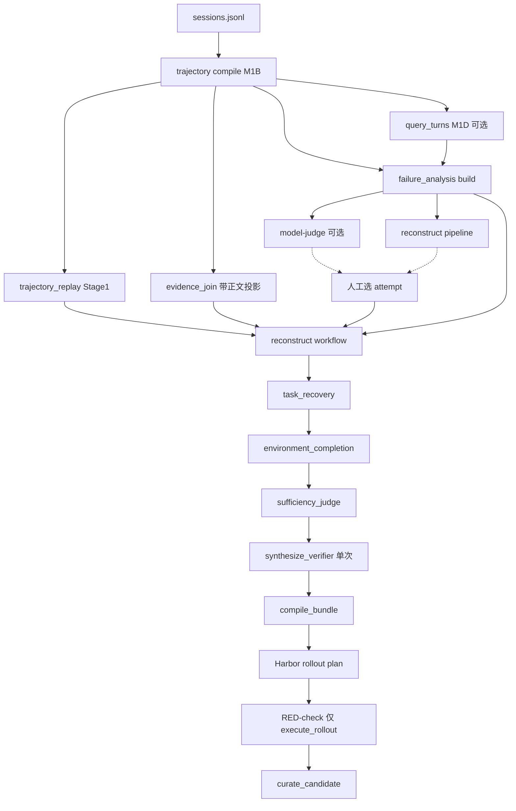

# TraceForge Agent World 重建项目交接文档

更新时间：2026-09-12

本文档是分支 `codex/agent-world-reconstruction` 的**唯一交接基线**。以代码和测试为准；若其它文档（含 README 中“停在 M1C、Harbor 未接入”等历史表述）与本文冲突，以本文和源码行为为准。

项目位置：

```text
/mnt/afs_toolcall/wujian1/Projects/workspace/TraceRconstruction
```

当前分支：

```text
codex/agent-world-reconstruction
```


## 一、阅读约定与禁止误报

在以下事项完成前，不得在交接、论文或实验报告中使用：

```text
“完整 Terminal-Universe 已复现”
“Harbor/AGS 已通过真实 E2E”
“已生成论文标准 SFT 数据”
```

应使用：

```text
“Stage 1 replay 已接入 workflow（Python API 的 normalized_run_dir）”
“Stage 2 候选生成和安全门禁已实现”
“Verifier 迭代协议已实现，真实容器执行待接入；workflow 仍走单次 synthesize_verifier”
“Harbor rollout plan 已实现，真实通过样本待产生”
```

兄弟仓 `harbor_ags` 上的 demo / strict-task-bundle 直播报告**不能**当作 TraceForge 重建闭环的 E2E 证据。


## 二、项目目标与三阶段

项目目标是把真实用户的 Agent 执行轨迹（尤其是失败、未完成或质量较差的轨迹）重建成可重新执行、可独立验证、且不泄漏答案的 Agent World 数据单元：

```text
失败轨迹
  → 可审计的失败事实
  → 重述后的 Task
  → 可执行且不泄漏答案的初始 Environment
  → 独立 Verifier
  → Harbor Task Bundle
  → Hermes/AGS 重新 rollout
  → reward、轨迹和验证结果
  → SFT 资格筛选
```

工程上对齐 Terminal-Universe 三阶段，但三阶段输出不能相互混淆：

```text
Stage1 确定性回放（只恢复首次完整 read；不执行 shell；不落盘 mutation）
  → Stage2 模型补全环境（只补证据支持的缺失/PARTIAL）
  → Stage3 只读充分性判断（UNKNOWN 必须 REVIEW）
  → verifier 合成 → Harbor bundle → RED-check → SFT
```

不变量：

- 模型推断不能覆盖 replay 事实；
- sufficiency 不能由模型的“READY”字符串单独替代规则复核；
- rollout 通过也不能绕过 RED-check；
- 原始事件不可覆盖，只能追加派生结果。


## 三、规则、模型、Agent 的边界

### 3.1 规则系统（确定性、可复现）

- `trajectory`：读取和校验 JSONL、事件排序、schema、source hash、capture 和 request boundary；
- `trajectory_replay`：按时间回放 read/write/edit，保存首次完整 read，隐藏写入和创建文件，记录 partial/barrier；不执行历史 shell；
- `trajectory.evidence_join`：选择目标 USER、历史上下文、尝试动作、尝试观察和尝试回答；工具结果按 `tool_pairings` 判断，不把 `RESULT_NOT_OBSERVED` 解释成失败；
- `environment_completion`：路径安全、禁止覆盖 COMPLETE/UNKNOWN 文件、只允许合法 evidence 引用、隐藏目录保护；
- `sufficiency` / `sufficiency_judge`：输入输出 schema、证据存在性和 `UNKNOWN/REVIEW` 门禁；
- `verifier`：测试语法、验收义务覆盖、oracle/mutation 数量和隐藏目录访问限制；
- `harbor_ags`：Bundle 布局、Harbor 配置、凭据环境变量、trial 结果和 artifact 读取；
- `red_check`：oracle 必须通过，nop/mutation 必须失败；
- `curation`：reward、verifier、泄漏、可复现性、confidence 和人工复核门禁；
- `control_plane`：阶段顺序、预算、retry、immutable artifact 和 review 状态（**独立引擎，未包住 workflow**）。

### 3.2 模型调用

- `failure_analysis.model_analyzer`：从确定性 failure report 中判断根因和重建价值；
- `semantic_recovery` / `task_recovery`：重述用户任务、提取意图、验收义务和歧义；
- `environment_completion`：生成补全文件、依赖和环境候选；
- `sufficiency_judge`：只读判断 workspace 是否充分；
- `verifier.synthesis`：提出隐藏测试、oracle solution 和 mutation solution；
- `verifier.iterative`：接收执行器反馈并有限次重新生成 verifier（**协议已实现，workflow 未调用**）；
- 后续 Cross-WS dependency judge 和 Multi-Round user agent 应通过相同 `ChatModel` 接口接入。

模型永远只能提出候选。模型输出的路径、hash、evidence pointer、READY 状态和“可解”判断都必须经过规则系统复核。

### 3.3 Agent

Agent 是带状态的流程角色，不等同于一次模型请求：

```text
Failure Analysis Agent
Task Recovery Agent
Environment Completion Agent
Sufficiency Agent
Verifier Agent
Hermes Solver Agent
Oracle/NOP/Mutation Agent
User Agent（Multi-Round）
```

当前已实现的 Agent 大多是单次模型调用包装器。`ControlPlane` 是确定性状态机，不是模型 Agent。


## 四、两条入口与人工衔接

仓库有两条入口，**不会自动串联**。README 的 M1 验收停点描述的是更早阶段；当前重建闭环以本节为准。



### 4.1 独立分析入口

`failure-analysis agentrx`、`failure-analysis model-judge` 和 TRACE 的 discovery/labeling 可以独立运行，但**不会**自动成为 `reconstruct workflow` 的前置阶段。

因此目前需要人工或外部脚本完成：

```text
M1B/M1D artifacts
  → failure-analysis build
  → [可选] AgentRx 或 model-judge
  → [可选] review-batch
  → 选择待重建 attempt
  → evidence_join 生成带 text 的 evidence.json
  → trajectory-replay 生成 workspace + files
  → 手工传给 reconstruct workflow
```

### 4.2 批量计划入口：`reconstruct pipeline`

`build_reconstruction_pipeline()` 会跑 M4 并发布 `selection_manifest.json` / `execution_plan.json`。下游模型、Harbor、Hermes、SFT 节点仍可能标记为 `PENDING_MODEL`。它**不调用**模型，也**不执行** Harbor。

### 4.3 单条闭环入口：`reconstruct workflow`

`run_reconstruction_workflow()` 是唯一端到端闭环。调用方必须提前准备：

- `report.json`（失败分析结构化报告）；
- `evidence.json`（**带正文投影**的证据数组，见第六节）；
- replay workspace 与 replay files（或 Python API 的 `normalized_run_dir`）；
- `attempt_ref`、`source_report_id`；
- `harbor_root`。

它不会自动从完整 `sessions.jsonl` 筛出待重建 session，也不会自动调用 AgentRx。


## 五、已接线 / 已实现未接线 / 未实现

### 5.1 已实现且已接入 `run_reconstruction_workflow()`

| 阶段 | 实际调用 | 路径 |
|------|----------|------|
| Stage 1 replay | `build_trajectory_replay()`（仅当传入 `normalized_run_dir`） | `trajectory_replay/pipeline.py` |
| Task | `run_task_recovery` → `semantic_recovery.recover(kind="task")` | `reconstruction/task_recovery.py`, `semantic_recovery.py` |
| Environment | `run_environment_completion` | `reconstruction/environment_completion.py` |
| Sufficiency | `run_sufficiency_judge` | `reconstruction/sufficiency_judge.py` |
| Verifier | 单次 `synthesize_verifier` | `verifier/synthesis.py` |
| Bundle | `compile_bundle`（主 / oracle / mutation） | `verifier/bundle.py` |
| Harbor plan | `build_rollout_plan` | `harbor_ags/rollout.py` |
| 可选执行 | `execute_rollout_plan` + `read_rollout_results` | `harbor_ags/rollout.py`, `results.py` |
| RED-check | `evaluate_red_check` | `verifier/red_check.py` |
| SFT 筛选 | `curate_candidate` | `curation/sft.py` |

### 5.2 已实现但未接入 workflow

| 模块 | 说明 |
|------|------|
| `reconstruction/terminal_universe_environment.py` | 更严格的 Stage1 `replay_initial_workspace` / `mutation_started` / `hidden_control`；workflow **未 import** |
| `verifier/iterative.py` | `VerifierExecutor` 协议与重试环；仓库无 Harbor 实现；workflow **仍走单次** `synthesize_verifier` |
| `reconstruction/control_plane.py` | 独立 gate engine；workflow 用硬编码条件代替 |
| `reconstruction/sufficiency.py` | 规则层 payload，与 judge 不同；workflow **未引用** |
| `requery/cross_workspace.py` | 确定性 profile / gap / prompt 骨架 |
| `requery/multi_round.py` | requirement tracker / follow-up prompt / 至少两轮 PASS 保留 |
| `requery/sft_export.py` | `export_sft_jsonl`；仅单测调用，workflow **不导出 JSONL** |

### 5.3 明确未完成

1. 将真实 Harbor verifier executor 接入 `verifier.iterative`，并让 workflow 使用迭代校准；
2. 在真实 Harbor/AGS 容器中运行 sufficiency judge；
3. 配置可用 Harbor CLI、Hermes、AGS sandbox，并产出 oracle pass / nop fail / mutation fail；
4. Cross-WS：TF-IDF、LLM dependency judge、双 workspace mount 真实 rollout；
5. Multi-Round：user agent、持久 workspace、逐轮 verifier；
6. 用真实通过的 rollout 生成首批论文标准 SFT JSONL；
7. 将 `ControlPlane` 的 gate decision 写入每个 workflow stage。


## 六、各阶段输入、输出、状态与失败条件

### 6.1 M1B 轨迹编译

路径：`src/traceforge/trajectory/pipeline.py`

- 输入：只读 `sessions.jsonl`；schema 如 `traceforge.r01-sessions.v1` 或 `traceforge.restored-long-capture.v1`。
- 一条 JSONL 行 ≈ 一个 capture（`capture_occurrence_id`）。
- 产物：`private/event_occurrences.jsonl`、`tool_pairings.jsonl`、`captures.jsonl` 等 + manifest/receipt。
- `RESULT_NOT_OBSERVED` 只表示 capture 内未观测到 tool result，**不是**工具执行失败。
- M4 的 `evidence_refs.jsonl` 是 **index-only**（无正文）；不能单独支撑 Task Recovery。

### 6.2 Evidence join（带正文投影）

路径：`src/traceforge/trajectory/evidence_join.py`

推荐：`build_query_task_input(...)`，产出 `traceforge.task-reconstruction-input.v2`。

每条 evidence 至少应有：

```text
evidence_id / evidence_ref_id
source_id
phase: PRE_TASK_CONTEXT | TARGET_REQUEST | ATTEMPT_ACTION | ATTEMPT_OBSERVATION | ATTEMPT_RESPONSE
text 或 payload
content_sha256
```

若 `evidence.json` 只有 `content_sha256` / pointer 而无 `text`，Task Recovery prompt 几乎为空，会安全停在 REVIEW。这是正确的数据充分性判定，不是“模型没调通”。

### 6.3 Stage 1：Deterministic Replay

路径：`src/traceforge/trajectory_replay/pipeline.py`  
入口：`build_trajectory_replay(normalized_run_dir, output_root, capture_id=None, ...)`

输出：

```text
replay_manifest.json
metrics.json
workspaces/<capture-id>/...
```

每个 capture 至少包含：

```json
{
  "capture_occurrence_id": "...",
  "workspace_path": "workspaces/<capture-id>",
  "files": [
    {
      "path": "...",
      "completeness": "COMPLETE|PARTIAL",
      "source_event_id": "...",
      "content_sha256": "..."
    }
  ],
  "withheld_changes": [],
  "partial_evidence": [],
  "unknown_mutation_barriers": [],
  "status": "RECOVERED|PARTIAL"
}
```

规则：

- 只物化首次完整 read 的 TOOL_RESULT；
- offset/limit/line range 读取进入 PARTIAL；
- write/edit/create 进入 `withheld_changes`，新内容永不落盘；
- shell/exec/terminal 等只记 barrier，**不执行**；
- capture 不唯一时必须显式传 `capture_id`，禁止跨 session 猜 workspace。

**实现差距（交付 replay）**：`_replay_capture` 声明了 `mutation_started`，但从未置为 `True`，因此 `read_after_first_mutation` 是死分支。mutation 后已观测文件靠 `modified_after_observation` 标 PARTIAL。更严格的“首次 mutation 后 read 不倒灌”只存在于未接线的 `terminal_universe_environment.replay_events()`。

### 6.4 Task Recovery

路径：`reconstruction/task_recovery.py` + `semantic_recovery.py`

输入：`report`、带 phase/text 的 `evidence`、`attempt_ref`、`source_report_id`、`ChatModel`。

候选字段：

```text
task_title
task_instruction
user_intent
acceptance_obligations
explicit_constraints
ambiguities
do_not_infer
evidence
confidence
decision ∈ {READY, REVIEW, DEFER, REJECT}
```

规则：

- 模型返回的 evidence 只允许引用输入 ID；
- `role` / `source_pointer` / `content_sha256` 由输入权威索引回填，不能信任模型改写；
- 最多 3 个候选。

Workflow 硬门禁：

1. `task_recovery.json` 的 `status == "COMPLETE"`；
2. 至少一个候选 `decision == "READY"`。

**实现差距（会阻断真实工具轨迹）**：`semantic_recovery.recover` 在全部候选 READY 时，若满足任一来源质量条件，会把 run status 降为 `REVIEW`（`SOURCE_QUALITY_REVIEW_REQUIRED`）：

- `report.status in {INCONCLUSIVE, REVIEW}`；
- `report.quality.requires_review`；
- `report.selection.pending_tool_call_count > 0`；
- `report.provenance.snapshot`；
- **evidence 中存在任意 `phase == "ATTEMPT_ACTION"`**。

真实 `evidence_join` 对 `TOOL_CALL` 正好标 `ATTEMPT_ACTION`。因此：**带工具调用的真实轨迹无法通过 workflow 的 COMPLETE 门禁**。现有单测 `test_source_quality_gate_overrides_ready` 覆盖了 INCONCLUSIVE + pending tool，没有单独锁定 ATTEMPT_ACTION 规则的产品意图。后续修复前，文档与实验必须按代码行为报告，不得声称“有工具调用的样本已 READY 入闭环”。

### 6.5 Environment Completion

路径：`reconstruction/environment_completion.py`（**不是** `terminal_universe_environment.py`）

输入：READY task、replay workspace、replay file completeness、evidence。

模型可提出：`files` / `dependencies` / `runtime_constraints` / `uncertainties` / `decision`。最多 5 候选。

规则门禁：

- 路径必须位于 workspace 内；拒绝 `..`、绝对宿主机路径、`.git`、`solution`、`tests`、`hidden_control`；
- COMPLETE / UNKNOWN replay 文件不可覆盖；
- 新文件必须引用真实 evidence ID，`provenance` 须为 `MODEL_COMPLETED`；
- 不得写入答案、测试、solution 或 expected output；
- 模型失败时发布 FAILED/REVIEW artifact，不伪造成功。

选型在 workflow 内联：仅 `环境候选 status==READY` 且 sufficiency `decision==READY && label==SUFFICIENT` 可入选；排序为 confidence 降序、uncertainty 数量升序、index 升序。

### 6.6 Sufficiency Judge

路径：`reconstruction/sufficiency_judge.py`

只读取 workspace，不修改。输出：

```json
{
  "label": "SUFFICIENT|INSUFFICIENT|UNKNOWN",
  "decision": "READY|REVIEW",
  "reason": "...",
  "missing_context": [],
  "evidence_ref_ids": [],
  "confidence": 0.0
}
```

`UNKNOWN`、缺 evidence、非法 label/confidence 或 JSON 解析失败会进入 REVIEW。当前是本地目录读取，**不是**论文中的容器内只读审查。

**实现差距**：`parse_json_object` 的 `ModelGatewayError` 会被捕获并降为 REVIEW；但 `model.complete()` 本身抛出的网关错误**未捕获**，会直接打穿 `run_reconstruction_workflow`。

### 6.7 Verifier

路径：`verifier/synthesis.py`（workflow 实际路径）；`verifier/iterative.py`（未接线）

合成契约：

- 自足 pytest；至少一组 missing-capability 与 protective 测试；
- `obligation_coverage` 的 key 必须覆盖全部 acceptance obligation id；
- 至少 2 个 oracle script + 1 个 mutation script；
- script 不得访问 `/tests` 或 `/solution`；
- 只做 AST / 引用校验，**不在宿主机执行**模型生成的 Python；
- 产物 `VerifierCandidate.status = "UNVALIDATED"`。

`synthesize_verifier_iterative` 最多 1–3 轮，依赖外部 `VerifierExecutor.run(candidate)` 返回 `PASS|FAIL|INFRA_ERROR`。真实 Harbor executor 尚未实现；workflow **不调用** iterative。

### 6.8 Harbor Bundle / Rollout / RED-check / SFT

Bundle（`verifier/bundle.py`）：Harbor schema 1.4；`environment_mode=separate`；`network_mode=no-network`；Agent 可见 `instruction.md` + `workspace/`；隐藏 `solution/`、`tests/`、`tests/control/`。

Rollout（`harbor_ags/rollout.py`）：

- 默认 `build_rollout_plan` → receipt `PLAN_ONLY`，不执行外部 Harbor；
- `execute_rollout=True` 才调用 `execute_rollout_plan`；
- 需要进程环境中的 `AGS_API_KEY`，Hermes 还需 `TOKENHUB_KEY` 或 `ANTHROPIC_API_KEY`；
- plan 只记录 env 名，**不嵌入密钥**。

Workflow 中的对照：

| 标签 | Bundle | agent_mode | 期望 |
|------|--------|------------|------|
| hermes | 主 bundle | hermes | 真实解题轨迹 |
| oracle_pass | oracle（solution_index=0） | oracle | PASS / reward 1.0 |
| nop_fail | 主 bundle | nop | FAIL / reward 0.0 |
| mutation_fail | mutation（mutation_index=0） | oracle | FAIL / reward 0.0 |

RED-check（`evaluate_red_check`）：三类 kind 必须齐全且结果匹配；`quality_gate.ok` 不为真时 trial 会被标成 `INFRA_ERROR`，导致 RED 失败。

SFT（`curation/sft.py`）默认阈值：

```text
task_recovery_confidence >= 0.8
environment_recovery_confidence >= 0.8
trajectory_quality >= 0.8
reward >= 1.0
verifier_status == PASS
solution_leakage == false
reproducible == true
```

`solution_leakage` / `reproducible` 必须是上游显式布尔：缺失 → REVIEW；明确违规 → REJECT。`export_sft_jsonl` 只接受 `ELIGIBLE` 行，且强制 `solution_leakage is False`、`reproducible is True`；当前 workflow **不调用**导出，仓库内**没有**论文标准 SFT JSONL 样本。


## 七、CLI 与 Python API 真相

### 7.1 CLI：`reconstruct workflow`

强制参数：

```bash
PYTHONPATH=src .venv/bin/python -m traceforge reconstruct workflow \
  --attempt-ref <attempt-ref> \
  --source-report-id <source-report-id> \
  --report-json <report.json> \
  --evidence-json <evidence.json> \
  --replay-workspace <workspace> \
  --replay-files-json <replay-files.json> \
  --harbor-root /mnt/afs_toolcall/wujian1/Projects/workspace/harbor_ags \
  --output <output-root> \
  --config /mnt/afs_toolcall/wujian1/Projects/workspace/TraceRconstruction/config.yaml \
  --channel deepseek \
  --model-name vol/deepseek-v4-flash-0731
```

**没有** `--normalized-run`。生产推荐先跑：

```bash
PYTHONPATH=src .venv/bin/python -m traceforge trajectory-replay \
  --normalized-run <m1b-run> \
  --capture-id <capture-id> \
  --output <replay-root>
```

再把 replay 产物喂给 workflow。增加 `--execute-rollout` 才会执行 Harbor/AGS 与 RED-check。

### 7.2 Python API

`run_reconstruction_workflow(..., normalized_run_dir=..., capture_id=...)` 会在 workflow 内调用 `build_trajectory_replay()`，再从 `replay_manifest.json` 绑定唯一 capture。未指定 `normalized_run_dir` 时必须同时提供 `replay_workspace` + `replay_files`；禁止默默使用未绑定的跨 session workspace。

### 7.3 模型网关

路径：`reconstruction/model_gateway.py`

- 有 `--config` → `NewAPIClient`；否则 → `OpusClient`；
- DeepSeek 重建可用 `vol/deepseek-v4-flash-0731` / `vol/deepseek-v4-pro-0813`；
- Hermes rollout 需要 `anthropic/<model>`（或显式 `--rollout-model`）；不要把 `vol/deepseek-*` 直接写入 Hermes；
- `config.yaml` 只允许存在部署机，已被 `.gitignore` 忽略；密钥不写入 artifact。


## 八、已实现未接线模块（勿误报为已闭环）

### 8.1 `terminal_universe_environment.py`

提供论文对齐原语：`replay_initial_workspace`、`build_completion_prompt`、`validate_completion_candidate`、`materialize_environment`、`select_sufficient_candidate`。会在 write/edit/delete/shell 时设置 `mutation_started=True`，拒绝 mutation 后完整 read 倒灌。当前生产闭环使用的是 `trajectory_replay` + `environment_completion`。

### 8.2 Cross-WS

`requery/cross_workspace.py` 已完成确定性基础层：读文件、过滤隐藏目录、抽语言/token/capability、方向性 gap、只读参考挂载提示。尚未实现 TF-IDF 检索、LLM dependency judge、真实双 workspace Harbor rollout。

### 8.3 Multi-Round

`requery/multi_round.py` 已完成 requirement tracker、PASS/FAIL follow-up 提示、连续 round 校验、至少两个 PASS round 保留门禁。尚未实现真实 user agent、持久 Harbor workspace、逐轮 verifier 再生。

### 8.4 ControlPlane

阶段顺序：`INGESTION → FAILURE_ANALYSIS → TASK_RECOVERY → ENVIRONMENT_COMPLETION → SUFFICIENCY → VERIFIER → BUNDLE → ROLLOUT → RED_CHECK → CURATION`。支持 PASS/REVIEW/RETRY/FAIL/BLOCKED、预算、不可变 artifact seal。`workflow.py` **零引用**。


## 九、真实样本走查记录

样本 capture 是一次请求快照，不是完整 session。实际观察到：

```text
10 events
7 PRE_TASK_CONTEXT
1 TARGET_REQUEST
1 ATTEMPT_RESPONSE
1 ATTEMPT_ACTION
0 ATTEMPT_OBSERVATION
1 RESULT_NOT_OBSERVED tool pairing
```

目标问题是根据之前提问推测用户画像；工具调用是 `chat_history_get(rounds=1..19)`。完整返回没有出现在 capture 中，所以：

- Task recovery 可以生成候选，但必须 REVIEW（来源质量 + 证据不足）；
- Environment completion 不能猜测缺失历史内容；
- 环境模型返回的未知 evidence 路径会被拒绝；
- 该样本不能进入 SFT。

这不是 pipeline 失败，而是正确的数据充分性判定。叠加第六节的 `ATTEMPT_ACTION` 门禁后，同类带工具调用样本在修复前也无法以 `COMPLETE` 通过 workflow。


## 十、测试、提交与开发规范

### 10.1 最近一轮针对性测试

```bash
cd /mnt/afs_toolcall/wujian1/Projects/workspace/TraceRconstruction
PYTHONPATH=src .venv/bin/python -m pytest -q \
  tests/test_trajectory_replay.py \
  tests/test_reconstruction_workflow.py \
  tests/test_evidence_join.py \
  tests/test_semantic_recovery.py \
  tests/test_model_gateway_config.py \
  tests/test_recovery_artifact_runners.py \
  tests/test_requery.py \
  tests/test_verifier_iterative.py
```

结果：`38 passed`。这证明目标模块的单元/集成替身测试通过，**不**证明真实 Harbor E2E 或论文标准 SFT 已产生。

相关提交：

```text
b4e2121  文档: 更新 Terminal-Universe 交接基线
45bdefc  清理: 规范工作流测试导入
6a03f90  功能: 增加验证器容器反馈循环
a05ee61  功能: 将确定性回放接入重建工作流
a695889  功能: 增加跨工作区多轮与 SFT 导出
c6ceca7  修复: 工作流阻断未通过任务门禁的候选
0ac088a  修复: 扩大环境候选响应预算
998ab21  修复: 对证据不足候选启用重建门禁
6c4d8db  修复: 持久化环境模型调用失败
74f6548  修复: 保留回流轨迹关键执行证据
```

### 10.2 修改纪律

遵循 `AGENTS.md`：

- 文档、注释、日志和提交信息使用简体中文；
- 原始事件不可覆盖；
- 解析、推断、执行、持久化职责分离；
- 新行为必须有正常和失败测试；
- 非确定性模型不进入普通 CI；
- 不提交真实回流、凭据、模型缓存和运行结果；
- 每个提交只解决一个明确问题。

开始修改前：

```bash
git status --short --branch
git log -8 --oneline
```

完成修改后至少：

```bash
git diff --check
PYTHONPATH=src .venv/bin/python -m pytest <与改动相关的测试> -q
.venv/bin/ruff check <与改动相关的源码和测试>
git status --short --branch
```


## 十一、失败分析层（与重建的关系）

### 11.1 M4 确定性层

`failure-analysis build` → `build_failure_analysis()`：对 M1B 事件做结构不变量检查，产出 `failure_analysis.jsonl` 与无正文的 `evidence_refs.jsonl`。无 FAIL 时 `primary_failure=INCONCLUSIVE`。`reconstruction_relevance` 在 M4 中常为 `NOT_RUN`。

### 11.2 Model-judge / AgentRx / TRACE

- model-judge：在已有 report + evidence 上判断 outcome、needs_reconstruction、decision；
- AgentRx：normalize → static → dynamic → check（Python 标 `NEEDS_SANDBOX`，主机不执行）→ judge；
- TRACE：六列表分区；无 SUCCESS/FAILURE 对照组时 contrastive gap 必须 unavailable，不得用 0 伪造。

三者都是可选研究/筛选适配器，**不自动**进入 workflow。

### 11.3 Review batch

`failure-analysis review-batch` 对 JSONL 去重排序取 Top-N，状态 `PENDING_HUMAN_REVIEW`，无模型、无正文复制。


## 十二、Harbor/AGS 运行环境注意

当前远程 `harbor_ags` 原 venv 可能来自 macOS，不能直接当 Linux 运行时。需要时重建 Linux venv，并在受控进程环境提供：

```text
AGS_API_KEY 或 E2B_API_KEY
TOKENHUB_KEY 或 ANTHROPIC_API_KEY
AGS_DOMAIN
AGS_TEMPLATE_ID
TOKENHUB_BASE_URL
```

不要把 key 写入 rollout plan、task bundle、artifact 或 Git。没有完整 Harbor CLI、AGS sandbox 和至少一次 oracle pass + nop fail + mutation fail 结果时，只能报告 PLAN_ONLY。


## 十三、常见误区

1. 不要把 failure report 当成原始事实；必须回溯 evidence。
2. 不要把 Agent 后续写入复制到初始 workspace。
3. 不要把 `solution/`、`tests/`、hidden control 放进 Agent 可见目录。
4. 不要在没有成功/失败标签时计算 TRACE contrastive gap。
5. 不要把 DeepSeek 模型名直接写到 Hermes Anthropic rollout 配置。
6. 不要用 `execute_rollout=True` 代替 Bundle、verifier 和 credential gate。
7. 不要把 `harbor_ags` demo E2E 报告当成 TraceForge 重建闭环证据。
8. 不要把“有 `terminal_universe_environment.py` / `iterative.py` / `ControlPlane` 文件”写成“已接入 workflow”。
9. 不要把仅含 hash 的 evidence 索引当成可重建输入。
10. 不要忽略 `ATTEMPT_ACTION` 会把 Task run 降为 REVIEW 的当前代码行为。


## 十四、继续开发时的推荐顺序

```text
1. 修复或明确 Task 的 SOURCE_QUALITY / ATTEMPT_ACTION 门禁产品语义，并补回归测试
2. 从 sessions.jsonl / M1B 恢复带正文的 evidence projection
3. CLI 暴露 normalized_run 或统一文档/API 的 replay 入口
4. 评估并接入更严的 terminal_universe_environment Stage1，或修复 trajectory_replay 的 mutation_started
5. 将真实 Harbor verifier executor 接入 iterative，并改 workflow 使用它
6. 重建 Linux Harbor/AGS venv，跑 preflight 与简单 Bundle E2E
7. 用真实重建 Bundle 产出 oracle/nop/mutation 与 Hermes 结果
8. 接入 ControlPlane 到各 stage 边界
9. 完成 Cross-WS / Multi-Round 的论文级闭环（如实验需要）
10. 导出首批 ELIGIBLE SFT JSONL，再接训练与论文实验
```


## 十五、验证原则

看到“模型调用成功”不能等同于“样本可训练”。必须按以下顺序确认：

```text
模型请求成功
  → JSON 合法
  → evidence 引用存在
  → Task status=COMPLETE 且候选 READY
  → Environment READY
  → Sufficiency = SUFFICIENT + READY
  → Verifier 通过独立执行校准（当前仅静态 UNVALIDATED）
  → Harbor reward 通过
  → 轨迹对账和 cleanup 通过
  → RED-check 通过
  → SFT eligibility = ELIGIBLE
  → （可选）export_sft_jsonl
```

任何中间阶段返回 REVIEW、BLOCKED、UNAVAILABLE 或 INFRA_ERROR，都不能进入 SFT。
