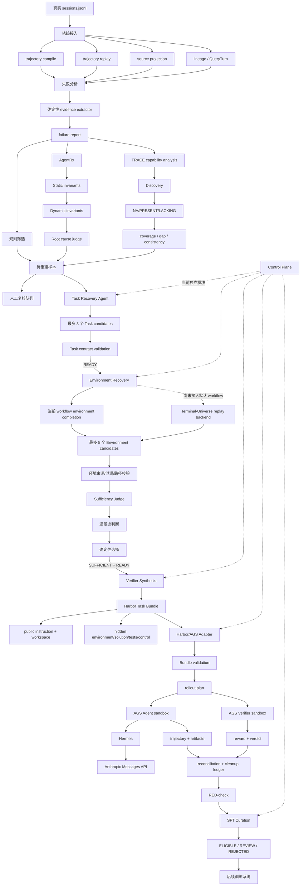

# TraceForge Agent World 重建项目交接文档

更新时间：2026-09-12

本文档面向后续继续开发的工程师，描述当前远程项目的真实代码状态、数据流、模块职责、产物契约、运行方式和未完成事项。本文档以代码为准；如果设计文档与代码冲突，应先以代码行为和测试为准，再更新本文档。


> **2026-09-12 实现更新（优先于本文档后面的历史记录）**
>
> 本节是当前分支 `codex/agent-world-reconstruction` 的事实基线。此前文档中“Terminal-Universe replay 尚未接入 workflow”“Cross-WS/Multi-Round 完全不存在”等表述已经过时；它们描述的是更新前状态。当前仍未完成的部分在“尚未完成与禁止误报”中单独列出。

### 当前目标与 Terminal-Universe 对齐标准

本项目采用 Terminal-Universe 的环境重建策略：

```text
normalized trajectory
  → deterministic replay
  → recovered intent/task
  → agentic environment completion
  → workspace sufficiency filtering
  → verifier construction
  → Harbor/AGS teacher rollout
  → RED-check
  → SFT admission/export
```

论文的 Stage 1 只恢复 Agent 首次修改前观测到的文件；Agent 创建、修改和未建模 shell mutation 必须 withheld。Stage 2 才允许 completion agent 根据任务和证据补充上下文；Stage 3 由只读 judge 判断环境是否足以完成任务。三阶段的输出不能相互混淆：模型推断不能覆盖 replay 事实，sufficiency 不能由模型的“READY”字符串替代，rollout 通过也不能绕过 RED-check。

### 规则、模型、Agent 的边界

**规则系统（确定性、可复现）**

- `trajectory`：读取和校验 JSONL、事件排序、schema、source hash、capture 和 request boundary；
- `trajectory_replay`：按时间回放 read/write/edit，保存首次完整 read，隐藏写入和创建文件，记录 partial/barrier；不执行历史 shell；
- `trajectory.evidence_join`：选择目标 USER、历史上下文、尝试动作、尝试观察和尝试回答；工具结果按 `tool_pairings` 判断，不把 `RESULT_NOT_OBSERVED` 解释成失败；
- `environment_completion`：路径安全、禁止覆盖 COMPLETE 文件、只允许合法 evidence 引用、隐藏目录保护；
- `sufficiency`：输入/输出 schema、证据存在性和 `UNKNOWN/REVIEW` 门禁；
- `verifier`：测试语法、验收义务覆盖、oracle/mutation 数量和隐藏目录访问限制；
- `harbor_ags`：Bundle 布局、Harbor 配置、凭据环境变量、trial 结果和 artifact 读取；
- `red_check`：oracle 必须通过，nop/mutation 必须失败；
- `curation`：reward、verifier、泄漏、可复现性、confidence 和人工复核门禁；
- `control_plane`：阶段顺序、预算、retry、immutable artifact 和 review 状态。

**模型调用**

- `failure_analysis.model_analyzer`：从确定性 failure report 中判断根因和重建价值；
- `semantic_recovery` / `task_recovery`：重述用户任务、提取意图、验收义务和歧义；
- `environment_completion`：生成补全文件、依赖和环境候选；
- `sufficiency_judge`：只读判断 workspace 是否充分；
- `verifier.synthesis`：提出隐藏测试、oracle solution 和 mutation solution；
- `verifier.iterative`：接收执行器反馈并有限次重新生成 verifier；
- 后续 Cross-WS dependency judge 和 Multi-Round user agent 应通过相同 `ChatModel` 接口接入。

模型永远只能提出候选。模型输出的路径、hash、evidence pointer、READY 状态和“可解”判断都必须经过规则系统复核。

**Agent**

Agent 是带状态的流程角色，不等同于一次模型请求：

```text
Failure Analysis Agent
Task Recovery Agent
Environment Completion Agent
Sufficiency Agent
Verifier Agent
Hermes Solver Agent
Oracle/NOP/Mutation Agent
User Agent（Multi-Round）
```

当前已实现的 Agent 大多是单次模型调用包装器；`verifier.iterative` 已提供“生成—执行器—反馈—再生成”协议，但真实 Harbor executor 尚未接入。`ControlPlane` 是确定性状态机，不是模型 Agent。

### 当前代码模块地图

```text
src/traceforge/trajectory/
  编译、事件契约、来源 hash、证据 provenance
src/traceforge/trajectory_replay/pipeline.py
  Terminal-Universe Stage 1 deterministic replay
src/traceforge/trajectory/evidence_join.py
  Query 级证据投影与工具配对
src/traceforge/failure_analysis/
  M4 规则分析、AgentRx/TRACE 适配、模型裁决
src/traceforge/reconstruction/semantic_recovery.py
  Task/Environment 语义候选和证据回填
src/traceforge/reconstruction/task_recovery.py
  Task recovery artifact runner
src/traceforge/reconstruction/environment_completion.py
  环境候选物化、路径和泄漏保护
src/traceforge/reconstruction/sufficiency_judge.py
  workspace 只读充分性判断
src/traceforge/verifier/synthesis.py
  verifier 候选生成与结构校验
src/traceforge/verifier/iterative.py
  verifier 生成—执行反馈循环协议
src/traceforge/verifier/bundle.py
  Harbor task / public workspace / hidden verifier bundle
src/traceforge/harbor_ags/
  Harbor plan、执行桥接、结果解析
src/traceforge/requery/
  Cross-WS profile/gap、Multi-Round tracker、SFT JSONL exporter
src/traceforge/curation/sft.py
  SFT eligibility 规则
```

### 主 workflow 的当前入口

推荐入口必须使用 normalized trajectory：

```python
run_reconstruction_workflow(
    attempt_ref=<attempt-ref>,
    source_report_id=<failure-report-id>,
    report=<failure-analysis-report>,
    evidence=<evidence-index>,
    normalized_run_dir=<normalized-run>,
    capture_id=<唯一-capture-id>,
    model=<ChatModel>,
    output_root=<output-root>,
    harbor_root=<harbor-ags-project>,
)
```

当 `normalized_run_dir` 存在时，workflow 首先调用 `build_trajectory_replay()`，然后从 `replay_manifest.json` 中读取唯一 capture 的 workspace 和文件索引，再传给 Environment Completion。未指定 normalized run 时仍兼容旧的 `replay_workspace/replay_files` 参数，但这条兼容路径不会自动证明 workspace 与 session 绑定；生产运行应禁止使用它。

workflow 的顺序和停止条件：

```text
1. deterministic replay
2. task recovery
   - task artifact 必须 status=COMPLETE
3. environment completion
4. candidate sufficiency judge
   - 仅 SUFFICIENT + READY 候选继续
5. verifier synthesis
6. Harbor bundle compilation
7. Harbor rollout plan
8. 可选真实执行（execute_rollout=True）
9. oracle/nop/mutation RED-check
10. SFT curation
11. SFT JSONL export
```

任何 Task `REVIEW`、Environment `REVIEW`、Sufficiency `UNKNOWN`、Verifier 未校准、Harbor 结果缺失或 RED-check 失败都会停止向 SFT 传递。

### Stage 1：Deterministic Replay 契约

`trajectory_replay.build_trajectory_replay()` 的输入是 normalized artifact，不是原始 session 任意文本。其输出目录包含：

```text
replay_manifest.json
metrics.json
workspaces/<capture-id>/...
```

每个 capture 的 manifest 至少包含：

```json
{
  "capture_occurrence_id": "...",
  "workspace_path": "workspaces/<capture-id>",
  "files": [
    {
      "path": "...",
      "completeness": "COMPLETE|PARTIAL",
      "source_event_id": "...",
      "content_sha256": "..."
    }
  ],
  "withheld_changes": [],
  "partial_evidence": [],
  "unknown_mutation_barriers": [],
  "status": "RECOVERED|PARTIAL"
}
```

规则：

- 只接受首次 mutation 前的完整 read-result；
- offset/limit/line range 读取进入 PARTIAL；
- mutation 后的 read 不作为初始完整文件；
- write/edit/create/delete 的新内容永不复制；
- shell、exec、terminal 等未建模修改形成 barrier；
- 不执行 trajectory 中的历史命令；
- capture 不唯一时必须显式传 `capture_id`，禁止跨 session 猜 workspace。

### Stage 2：Task Recovery 契约

Task recovery 的输入不是“最后一条消息”，而是证据投影：

```text
PRE_TASK_CONTEXT
TARGET_REQUEST
ATTEMPT_RESPONSE
ATTEMPT_ACTION
ATTEMPT_OBSERVATION
```

模型提示会保留：

- 用户原始目标；
- 任务前历史用户问题和可见上下文；
- Agent 工具名称、参数、调用 ID；
- 工具结果是否真正观测到；
- source_id、source_pointer、content_sha256；
- 证据覆盖和裁剪情况。

模型返回的 evidence 只允许引用输入 ID。返回的 role、source pointer 和 hash 会由输入索引回填，不能信任模型改写。

Task 候选必须包含：

```text
task_title
task_instruction
user_intent
acceptance_obligations
explicit_constraints
ambiguities
do_not_infer
evidence
confidence
decision
```

如果来源是 snapshot、存在 pending tool result、输入被截断或 report 为 INCONCLUSIVE，即使模型返回 READY，最终 recovery status 也必须是 REVIEW。

### Stage 2：Environment Completion 契约

Environment Completion 接收：

```text
task candidate
replayed workspace
replay file completeness
trajectory evidence
```

模型只允许提出：

```text
files
  path
  content
  provenance
  evidence_ref_ids
dependencies
runtime_constraints
uncertainties
decision
```

规则门禁：

- 文件路径必须位于 workspace 内；
- 不允许 `..`、绝对宿主机路径、`.git`、solution、tests、hidden_control；
- COMPLETE replay 文件不可覆盖；
- 新文件必须引用真实 evidence ID；
- completion 不得写任务答案、测试、solution 或 expected output；
- 所有候选必须保留 uncertainty；
- 模型返回非 JSON、超时或未知 evidence 时发布 FAILED/REVIEW artifact，不伪造成功。

当前环境 completion 已支持多个候选，但真正进入下游前还必须通过只读 sufficiency judge。

### Stage 3：Sufficiency Judge 契约

Sufficiency judge 只读取 workspace，不修改 workspace。输出：

```json
{
  "label": "SUFFICIENT|INSUFFICIENT|UNKNOWN",
  "decision": "READY|REVIEW",
  "reason": "...",
  "missing_context": [],
  "evidence_ref_ids": [],
  "confidence": 0.0
}
```

`UNKNOWN`、缺 evidence、非法 label、非法 confidence 或模型调用失败都会进入 REVIEW。当前 judge 的真实容器执行尚未完成，不能把本地目录读取等同于论文中的容器内只读审查。

### Verifier 与论文的对应

论文要求 verifier agent 在目标容器中生成测试，并通过执行反馈迭代校正。当前实现分为两层：

1. `verifier.synthesis`：模型生成 pytest、oracle 和 mutation solution；规则只做 AST、字段、义务覆盖和隐藏路径检查；
2. `verifier.iterative`：调用外部 `VerifierExecutor.run(candidate)`，将 PASS/FAIL/INFRA_ERROR 反馈给模型，最多重试 3 轮。

当前 `VerifierExecutor` 仍是协议，固定替身测试已覆盖；真实 Harbor executor 需要把候选测试复制到 verifier sandbox 中执行，再将有界 stdout/stderr 和测试摘要反馈给模型。模型生成的 Python 禁止在宿主机直接执行。

### Harbor/AGS 与 Hermes

`harbor_ags.rollout.build_rollout_plan()` 负责：

- 校验 Harbor task bundle；
- 复制成 Harbor dataset；
- 生成冻结 Harbor config；
- 写入 Hermes/oracle/nop 模式和 trials；
- 记录凭据需求但不保存凭据。

`execute_rollout_plan()` 才会启动外部 Harbor。真实执行需要：

```text
AGS_API_KEY
TOKENHUB_KEY 或 ANTHROPIC_API_KEY
Harbor .venv/bin/harbor
harbor_ags/configs/{hermes-batch,oracle,nop}.yaml
```

没有完整 Harbor CLI、AGS sandbox 和至少一次 oracle pass+nop fail+mutation fail 结果时，不能报告“Harbor/AGS 已打通”，只能报告 PLAN_ONLY。

### Cross-WS 实现状态

`traceforge.requery.cross_workspace` 当前完成 deterministic 基础层：

- 读取 workspace 文件；
- 过滤隐藏目录；
- 提取语言、tokens 和 capability markers；
- 计算方向性 capability gap；
- 生成 reference workspace 只读挂载的任务提示。

论文完整策略还需要：

```text
workspace profile agent
  → TF-IDF nearest-neighbor retrieval
  → LLM directional dependency judge
  → target writable + reference read-only Harbor mount
  → verifier-filtered rollout
```

当前尚未实现 TF-IDF 检索、LLM dependency judge 和真实双 workspace Harbor rollout。

### Multi-Round 实现状态

`traceforge.requery.multi_round` 当前完成 deterministic 基础层：

- requirement tracker；
- active/satisfied/updated/replaced 状态；
- 根据 PASS/FAIL 生成后续用户反馈提示；
- 连续 round 序号校验；
- 至少两个 PASS round 的保留门禁。

论文完整策略还需要：

```text
初始 rollout
  → user agent 更新 requirement tracker
  → verifier 为当前 round 生成测试
  → Harbor 持久 workspace 执行
  → 自然语言用户反馈
  → 最多六个 follow-up round
  → 至少两个 verified PASS round 保留
```

当前还没有真实 user agent、持久 Harbor workspace 和多轮 rollout。

### SFT 数据契约

`traceforge.requery.sft_export.export_sft_jsonl()` 只接受明确 `ELIGIBLE` 的 row，并强制检查：

```text
candidate_id
 task
 trajectory
solution_leakage == False
reproducible == True
```

实际进入训练集还必须同时满足 `curation.sft.curate_candidate()`：

- verifier status PASS；
- reward 达到阈值；
- task/environment confidence 达标；
- trajectory quality 达标；
- leakage 明确为 False；
- reproducible 明确为 True。

当前 exporter 和规则测试已经存在，但由于真实 Harbor 尚未产出合格 trial，当前项目没有可以声称“论文标准 SFT 已生成”的样本。

### 真实样本走查记录

样本 capture 是一次请求快照，不是完整 session。实际观察到：

```text
10 events
7 PRE_TASK_CONTEXT
1 TARGET_REQUEST
1 ATTEMPT_RESPONSE
1 ATTEMPT_ACTION
0 ATTEMPT_OBSERVATION
1 RESULT_NOT_OBSERVED tool pairing
```

目标问题是根据之前提问推测用户画像；工具调用是 `chat_history_get(rounds=1..19)`。完整返回没有出现在 capture 中，所以：

- Task recovery 可以生成候选，但必须 REVIEW；
- Environment completion 不能猜测缺失历史内容；
- 环境模型返回的未知 evidence 路径会被拒绝；
- 该样本不能进入 SFT。

这不是 pipeline 失败，而是正确的数据充分性判定。

### 测试和提交记录

最近一轮针对性测试：

```bash
PYTHONPATH=src .venv/bin/python -m pytest -q \
  tests/test_trajectory_replay.py \
  tests/test_reconstruction_workflow.py \
  tests/test_evidence_join.py \
  tests/test_semantic_recovery.py \
  tests/test_model_gateway_config.py \
  tests/test_recovery_artifact_runners.py \
  tests/test_requery.py \
  tests/test_verifier_iterative.py
```

结果：`38 passed`。相关提交：

```text
74f6548  修复: 保留回流轨迹关键执行证据
6c4d8db  修复: 持久化环境模型调用失败
998ab21  修复: 对证据不足候选启用重建门禁
0ac088a  修复: 扩大环境候选响应预算
c6ceca7  修复: 工作流阻断未通过任务门禁的候选
a695889  功能: 增加跨工作区多轮与 SFT 导出
a05ee61  功能: 将确定性回放接入重建工作流
6a03f90  功能: 增加验证器容器反馈循环
```

### 尚未完成与禁止误报

以下项目仍然明确未完成：

1. 将真实 Harbor verifier executor 接入 `verifier.iterative`；
2. 在真实 Harbor/AGS 容器中运行 sufficiency judge；
3. 配置可用 Harbor CLI、Hermes、AGS sandbox 并产出 oracle pass/nop fail/mutation fail；
4. 将 Cross-WS 的 TF-IDF、dependency judge 和双 workspace mount 接入真实 rollout；
5. 将 Multi-Round user agent、持久 workspace 和逐轮 verifier 接入 workflow；
6. 用真实通过的 rollout 生成首批 SFT JSONL；
7. 将 `ControlPlane` 的 gate decision 写入每个 workflow stage，而不是仅作为独立 engine。

在以上项目完成前，不得在交接、论文或实验报告中使用：

```text
“完整 Terminal-Universe 已复现”
“Harbor/AGS 已通过真实 E2E”
“已生成论文标准 SFT 数据”
```

应使用：

```text
“Stage 1 replay 已接入”
“Stage 2 候选生成和安全门禁已实现”
“Verifier 迭代协议已实现，真实容器执行待接入”
“Harbor rollout plan 已实现，真实通过样本待产生”
```

项目位置：

```text
/mnt/afs_toolcall/wujian1/Projects/workspace/RraceRconstruction
```

当前分支：

```text
codex/agent-world-reconstruction
```

## 一、项目目标

项目目标是把真实用户的 Agent 执行轨迹，尤其是失败、未完成或质量较差的轨迹，重建成一个可以重新执行和验证的 Agent World 数据单元：

```text
失败轨迹
  → 可审计的失败事实
  → 重述后的 Task
  → 可执行且不泄漏答案的初始 Environment
  → 独立 Verifier
  → Harbor Task Bundle
  → Hermes/AGS 重新 rollout
  → reward、轨迹和验证结果
  → SFT 资格筛选
```

核心研究问题是：

> 失败轨迹是否仍包含足够信息，使我们能够重建出任务等价、环境可执行、且不泄漏答案的 Task–Environment 对？

工程上必须区分三类内容：

- 原始轨迹事实：不可覆盖，只能追加派生结果；
- 模型推断：必须带证据引用、版本、置信度和不确定性；
- 执行验证：必须由独立 verifier 和 Harbor/AGS 结果确认。

## 二、整体架构



图中每个“Agent”目前都是一个受窄接口约束的模型调用阶段，不是独立微服务。模型由 `ChatModel.complete()` 注入，各阶段使用不同 prompt 和不同输出 contract。

## 三、代码目录和职责

### 3.1 轨迹和来源层

```text
src/traceforge/trajectory/
src/traceforge/trajectory_replay/
src/traceforge/source_projection/
src/traceforge/lineage/
src/traceforge/query_turns/
```

职责：

- 读取冻结的 JSONL 来源；
- 校验 source schema；
- 标准化 session、event、tool call、tool result；
- 保留原始内容的 hash 和 provenance；
- 识别一个 session 内的 capture、episode、attempt、query turn 关系；
- 在任务开始前恢复公开 workspace；
- 对未知文件变更建立 mutation barrier，不能臆造历史状态。

主要 CLI：

```bash
traceforge trajectory compile \
  --input <sessions.jsonl> \
  --dataset-id <dataset-id> \
  --source-schema <schema> \
  --output <artifact-root>

traceforge trajectory-replay \
  --normalized-run <normalized-run> \
  --capture-id <capture-id> \
  --output <artifact-root>

traceforge source-projection build \
  --m1b-run <m1b-run> \
  --output <artifact-root>

traceforge lineage build \
  --m1b-run <m1b-run> \
  --output <artifact-root>

traceforge query-turns build \
  --m1b-run <m1b-run> \
  --output <artifact-root>
```

预期产物：

- 标准化轨迹 artifact；
- immutable source manifest；
- replay workspace；
- 文件完整性清单；
- provenance 和 lineage；
- QueryTurn 图。

### 3.2 失败分析层

```text
src/traceforge/failure_analysis/extractor.py
src/traceforge/failure_analysis/pipeline.py
src/traceforge/failure_analysis/agentrx_pipeline.py
src/traceforge/failure_analysis/trace_capabilities.py
src/traceforge/failure_analysis/review_batch.py
src/traceforge/failure_analysis/model_analyzer.py
src/traceforge/failure_analysis/model_runner.py
```

确定性部分先生成 evidence 和 failure report，模型只在已有事实之上做解释。

AgentRx pipeline 的顺序是：

```text
normalize trajectory
  → static invariant generation
  → dynamic invariant generation for prefixes
  → strict check status normalization
  → root cause judge
```

AgentRx 适配器不会在主进程执行模型生成的 Python；`python_check` 会标记为 `NEEDS_SANDBOX`。所有模型输出必须引用输入中存在的 evidence id。

主要 CLI：

```bash
traceforge failure-analysis build \
  --m1b-run <m1b-run> \
  --m1d-run <m1d-run> \
  --output <artifact-root>

traceforge failure-analysis agentrx \
  --trajectory-json <trajectory.json> \
  --output <diagnosis.json> \
  --config /mnt/afs_toolcall/wujian1/Projects/workspace/RraceRconstruction/config.yaml \
  --channel deepseek \
  --model-name vol/deepseek-v4-flash-0731

traceforge failure-analysis review-batch \
  --input-jsonl <failure-reports.jsonl> \
  --output <review-root> \
  --limit 50
```

TRACE 只有在存在可信的成功和失败标签时，才会计算 contrastive gap。没有标签时必须返回 unavailable，而不是把未知值当成零。

### 3.3 模型网关

```text
src/traceforge/reconstruction/model_gateway.py
```

核心接口：

```python
class ChatModel(Protocol):
    def complete(self, request: ModelRequest) -> ModelResponse: ...
```

当前后端：

- `OpusClient`：Anthropic Messages API，默认读取环境变量；
- `NewAPIClient`：TokenHub/NewAPI OpenAI-compatible `/v1/chat/completions`；
- `build_chat_model()`：根据 `--config` 和 `--channel` 选择后端；
- `resolve_model_name()`：避免把 Claude 模型名误发到 DeepSeek/GPT channel。

密钥规则：

- `config.yaml` 只允许存在部署机；
- key 只驻留模型客户端内存；
- 不写入 receipt、日志、prompt artifact 或 trajectory artifact；
- `config.yaml` 已被 `.gitignore` 忽略；
- 当前 DeepSeek 可用模型包括 `vol/deepseek-v4-flash-0731` 和 `vol/deepseek-v4-pro-0813`。

推荐：

- 第一阶段重建使用 `vol/deepseek-v4-flash-0731`；
- 高质量候选可用 `vol/deepseek-v4-pro-0813`；
- Hermes 当前只接受 Anthropic-compatible 的 `anthropic/<model>`，不能直接传 `vol/deepseek-*`。

### 3.4 Task Recovery

```text
src/traceforge/reconstruction/task_recovery.py
src/traceforge/reconstruction/semantic_recovery.py
src/traceforge/reconstruction/contracts.py
```

输入：

- `report.json`；
- `evidence.json`；
- `attempt_ref`；
- `source_report_id`；
- ChatModel。

输出：

```text
stages/task/<run-id>/task_recovery.json
stages/task/<run-id>/metrics.json
stages/task/<run-id>/private/model_exchange.json
stages/task/<run-id>/artifact_manifest.json
stages/task/<run-id>/run_receipt.json
```

Task candidate 必须包含：

- `task_title`；
- `task_instruction`；
- `user_intent`；
- `acceptance_obligations`；
- `explicit_constraints`；
- `ambiguities`；
- `do_not_infer`；
- evidence references；
- confidence；
- decision。

只有 `decision=READY` 才能进入环境阶段。`REVIEW`、`DEFER`、`REJECT` 不能被下游强行转换为 READY。

### 3.5 Environment Recovery

当前相关文件：

```text
src/traceforge/reconstruction/environment_completion.py
src/traceforge/reconstruction/terminal_universe_environment.py
src/traceforge/reconstruction/sufficiency_judge.py
src/traceforge/reconstruction/sufficiency.py
```

旧 workflow 路径：

```text
run_environment_completion()
```

Terminal-Universe 对齐后端：

```text
replay_initial_workspace()
build_completion_prompt()
validate_completion_candidate()
materialize_environment()
```

Terminal-Universe 后端的关键不变量：

- 只使用任务开始前第一次完整读取的文件；
- 后续 mutation 不得反向填充初始 workspace；
- 未观察到的文件不得从源 workspace 复制；
- write/edit/create 和 shell barrier 进入 hidden withheld changes；
- environment completion 只能补全证据支持的环境；
- 不得放入 implementation、tests、solution 或答案；
- 最多生成 5 个候选；
- 每个候选必须保留 evidence provenance。

当前主要缺口：`terminal_universe_environment.py` 已实现，但尚未成为 `workflow.py` 的默认环境生成路径。后续接入时必须保留旧路径的回归测试，并逐候选比较两种实现的输出。

### 3.6 Sufficiency Judge

每个环境候选都会独立判断：

- 能否完成 Task；
- 是否缺少必要文件；
- 是否存在环境和 evidence 冲突；
- 是否泄漏 solution；
- 是否含未解释的关键不确定性。

选中条件：

```text
decision == READY
label == SUFFICIENT
```

选择排序：

```text
confidence 降序
uncertainty 数量升序
候选 index 升序
```

该顺序必须保持确定性，不能用模型再次随机挑选。

### 3.7 Verifier 和 Harbor Bundle

```text
src/traceforge/verifier/synthesis.py
src/traceforge/verifier/bundle.py
src/traceforge/verifier/grading.py
src/traceforge/verifier/red_check.py
```

标准 Bundle：

```text
<task>/
├── task.toml
├── instruction.md
├── workspace/
├── environment/
├── solution/
└── tests/
    ├── grader.py
    ├── rubric.json
    ├── test.sh
    └── control/
```

Agent 可见：

```text
instruction.md
workspace/
```

Agent 不可见：

```text
environment/
solution/
tests/
tests/control/
```

Bundle 必须满足：

- Harbor schema 1.4；
- verifier environment mode 为 `separate`；
- network mode 为 `no-network`；
- `tests/test.sh` 符合固定契约；
- hidden control 存在；
- grader、rubric 和 control 不进入 Agent workspace。

### 3.8 Harbor/AGS/Hermes

```text
src/traceforge/harbor_ags/adapter.py
src/traceforge/harbor_ags/rollout.py
src/traceforge/harbor_ags/results.py
```

Harbor 配置：

```text
/mnt/afs_toolcall/wujian1/Projects/workspace/harbor_ags/configs/hermes-batch.yaml
/mnt/afs_toolcall/wujian1/Projects/workspace/harbor_ags/configs/hermes-certification.yaml
```

运行时组件：

```text
harbor_ags.agent:LosslessHermesAgent
harbor_ags.environment:AGSPrebuiltEnvironment
```

流程：

```text
Task Bundle
  → validate_bundle_layout
  → build_rollout_plan
  → Harbor Dataset
  → Agent AGS sandbox
  → Hermes
  → 独立 Verifier AGS sandbox
  → result.json
  → cleanup ledger
```

当前模型边界：

```text
TraceForge reconstruction model: DeepSeek / NewAPI
Hermes rollout model: Anthropic Messages API
```

不要把 DeepSeek 名称直接写入 Hermes rollout。代码已经在计划阶段拒绝非 `anthropic/<model>` 的隐式 Hermes 模型。

### 3.9 SFT Curation

```text
src/traceforge/curation/sft.py
```

只有同时满足以下条件，样本才有资格进入 SFT：

- Harbor 任务 reward 通过；
- independent verifier 通过；
- 无 infrastructure error；
- 有完整 trace capture；
- 有 reconstruction provenance；
- 任务和环境没有答案泄漏；
- RED-check 结果满足当前实验门槛。

当前模块只生成 `ELIGIBLE / REVIEW / REJECTED` curation artifact，还没有接入实际训练脚本、checkpoint 管理和下游评测。

## 四、主 workflow 的真实顺序

入口：

```text
src/traceforge/reconstruction/workflow.py
```

`run_reconstruction_workflow()` 当前执行顺序：

```text
1. canonicalize_evidence
2. run_task_recovery
3. 选择 READY Task candidate
4. run_environment_completion
5. 对每个环境候选运行 sufficiency judge
6. 选择 SUFFICIENT + READY candidate
7. synthesize_verifier
8. compile_bundle
9. 编译 oracle bundle 和 mutation bundle
10. 创建 Harbor Hermes rollout plan
11. 如果 execute_rollout=True，执行 Harbor rollout
12. 读取 Harbor results
13. 运行 RED-check
14. 运行 SFT curation
15. 发布最终 workflow artifact
```

重要：模型调用虽然是多个阶段，但目前由同一个注入的 `ChatModel` 实例承载；不同阶段通过不同 prompt 和 contract 区分。

## 五、控制平面

```text
src/traceforge/reconstruction/control_plane.py
src/traceforge/reconstruction/control_plane_contracts.py
```

已实现：

- 固定阶段顺序；
- `PASS / REVIEW / RETRY / FAIL / BLOCKED`；
- 最大尝试次数；
- 总重试预算；
- 超时和 temperature；
- environment candidate 上限；
- evidence 数量门禁；
- 人工复核门禁；
- artifact SHA256 seal；
- review resolution 校验；
- 不可变 gate decision。

当前状态：控制平面是独立 gate engine，还没有完整包裹 `run_reconstruction_workflow()`。接入时建议由 workflow 在每个阶段开始和结束时写入 gate decision，禁止通过异常捕获绕过 gate。

## 六、模型和真实运行配置

配置文件：

```text
/mnt/afs_toolcall/wujian1/Projects/workspace/RraceRconstruction/config.yaml
```

使用 DeepSeek 重建：

```bash
PYTHONPATH=src .venv/bin/python -m traceforge reconstruct workflow \
  --attempt-ref <attempt-ref> \
  --source-report-id <source-report-id> \
  --report-json <report.json> \
  --evidence-json <evidence.json> \
  --replay-workspace <workspace> \
  --replay-files-json <replay-files.json> \
  --harbor-root /mnt/afs_toolcall/wujian1/Projects/workspace/harbor_ags \
  --output <output-root> \
  --config /mnt/afs_toolcall/wujian1/Projects/workspace/RraceRconstruction/config.yaml \
  --channel deepseek \
  --model-name vol/deepseek-v4-flash-0731
```

当前 demo 使用上述命令时，由于 evidence 没有原始文本，Task Recovery 会产生 `REVIEW`，workflow 会安全停止，不会进入 Harbor。

Harbor 执行前必须在受控进程环境中提供：

```text
AGS_API_KEY 或 E2B_API_KEY
TOKENHUB_KEY 或 ANTHROPIC_API_KEY
AGS_DOMAIN
AGS_TEMPLATE_ID
TOKENHUB_BASE_URL
```

不能把 key 写入 rollout plan、task bundle、artifact 或 Git。

## 七、测试和静态检查

项目要求 Python 3.12。远程 RraceRconstruction venv 可用，但远程 harbor_ags 原 venv 是从 macOS 搬来的，不能直接使用。

推荐测试命令：

```bash
cd /mnt/afs_toolcall/wujian1/Projects/workspace/RraceRconstruction
PYTHONPATH=src .venv/bin/python -m pytest tests/test_model_gateway_config.py -q
PYTHONPATH=src .venv/bin/python -m pytest \
  tests/test_model_gateway_config.py \
  tests/test_terminal_universe_environment.py \
  tests/test_control_plane.py \
  tests/test_reconstruction_workflow.py \
  tests/test_agentrx_pipeline.py -q
.venv/bin/ruff check \
  src/traceforge/reconstruction/model_gateway.py \
  src/traceforge/reconstruction/workflow.py \
  src/traceforge/cli.py \
  tests/test_model_gateway_config.py \
  tests/test_reconstruction_workflow.py
```

已验证：

- NewAPI 配置测试：4 passed；
- 重建、AgentRx、控制面和环境测试：相关测试通过；
- 修改文件的 Ruff 检查通过；
- DeepSeek Flash 和 Pro 真实最小请求均成功；
- AGS API 认证探测返回 HTTP 200；
- Gemini channel 当前没有可用 Gemini 后端；
- 当前最新重建 Bundle 尚未完成新的 Hermes + AGS E2E。

## 八、已知问题和优先级

### P0：恢复完整 evidence payload

当前某些 demo 的 `evidence.json` 只有：

```text
content_sha256
evidence_id
evidence_kind
source_pointer
source_id
```

缺少用户 query、assistant tool call、tool result 和环境观察文本。不能用这种索引直接做可信 Task/Environment Recovery。

必须从原始 source run 做 evidence join，生成带内容但受 privacy/provenance 约束的模型输入 projection。

### P0：重建 Linux Harbor/AGS 运行环境

当前：

- `harbor_ags/.venv/bin/python` 是 macOS Mach-O；
- pydantic_core 是 Darwin 动态库；
- shebang 指向旧机器；
- 当前 venv 不能运行 Harbor preflight；
- 当前 shell 没有自动注入 AGS/Hermes 凭据。

建议：

```bash
uv venv --python /mnt/afs_toolcall/wujian1/.local/bin/python3.12 /tmp/traceforge-harbor-ags-venv
uv pip install --python /tmp/traceforge-harbor-ags-venv/bin/python \
  -e /mnt/afs_toolcall/wujian1/Projects/workspace/harbor_ags
```

如果内部源不可达，先检查 uv index 和缓存，不要把 macOS venv 继续复用。

### P1：接入 Terminal-Universe 环境后端

把 `terminal_universe_environment.replay_initial_workspace()` 的结果接入 `workflow.py`，并保留：

- first complete read 规则；
- mutation barrier；
- withheld changes；
- 五候选上限；
- path/provenance/leak 校验。

### P1：接入 Control Plane

让 workflow 每个阶段都产生不可变 gate decision：

```text
input gate
→ task gate
→ environment gate
→ sufficiency gate
→ verifier gate
→ bundle gate
→ rollout gate
→ result gate
→ SFT admission gate
```

### P1：完成当前 Bundle 的真实 E2E

验收必须包含：

- Harbor Bundle validator；
- AGS sandbox create；
- Hermes version/commit；
- Anthropic request；
- tool use；
- agent trajectory；
- separate verifier；
- reward/verdict；
- cleanup ledger；
- artifact reconciliation。

### P2：接入实际 SFT 训练

目前只有 curation artifact。后续要明确：

- SFT JSONL/Parquet schema；
- prompt 和 completion 投影；
- 是否保留失败轨迹作为负例；
- 训练/验证/测试拆分；
- checkpoint 和实验记录；
- baseline、ablation 和指标。

## 九、常见误区

1. 不要把 failure report 当成原始事实。它是派生结果，必须回溯 evidence。
2. 不要把 Agent 的后续写入文件复制到初始 workspace。
3. 不要把 `solution/`、`tests/`、hidden control 放进 Agent 可见目录。
4. 不要在没有成功/失败标签时计算 TRACE contrastive gap。
5. 不要把 DeepSeek 模型名直接写到 Hermes Anthropic rollout 配置。
6. 不要用 `execute_rollout=True` 代替 Bundle、verifier 和 credential gate。
7. 不要把当前历史 E2E 报告当成最新代码在当前机器上的 E2E 证据。
8. 不要将真实回流数据、配置文件、模型响应和密钥提交到 Git。

## 十、交接后的推荐工作顺序

```text
1. 从 sessions.jsonl 恢复带内容的 evidence projection
2. 选 50 条失败/未完成样本，建立人工复核 golden set
3. 用 DeepSeek Flash 跑 Task Recovery，统计 READY/REVIEW/REJECTED
4. 将 Terminal-Universe environment backend 接入主 workflow
5. 用 DeepSeek Flash 生成五候选环境并运行 Sufficiency Judge
6. 用 DeepSeek Pro 复核高价值样本的 Task/Environment 候选
7. 重建 Linux Harbor/AGS venv
8. 跑 preflight --probe-ags
9. 用一个简单 Bundle 完成 Hermes + AGS + verifier E2E
10. 再跑真实重建 Bundle
11. 通过 reward、verifier、cleanup 和 provenance 门禁
12. 生成 SFT curation 数据
13. 最后接训练和论文实验
```

## 十一、提交和修改规范

遵循仓库中的 `AGENTS.md`：

- 文档、注释、日志和提交信息使用简体中文；
- 原始事件不可覆盖；
- 解析、推断、执行、持久化职责分离；
- 新行为必须有正常和失败测试；
- 非确定性模型不进入普通 CI；
- 不提交真实回流、凭据、模型缓存和运行结果；
- 每个提交只解决一个明确问题。

开始修改前先执行：

```bash
git status --short --branch
git log -8 --oneline
```

完成修改后至少执行：

```bash
git diff --check
PYTHONPATH=src .venv/bin/python -m pytest <与改动相关的测试> -q
.venv/bin/ruff check <与改动相关的源码和测试>
git status --short --branch
```

## 十二、主 DAG 与独立模块的区别

当前仓库有两种入口，不能混淆：

### 独立分析入口

`failure-analysis agentrx`、`failure-analysis model-judge` 和 TRACE 的 discovery/labeling 可以独立运行，但不会自动成为 `reconstruct workflow` 的前置阶段。

因此目前需要人工或外部脚本完成：

```text
M1B/M1D artifacts
  → failure-analysis build
  → AgentRx 或 model-judge
  → 选择待重建 attempt
  → 手工传给 reconstruct workflow
```

### 单条重建入口

`reconstruct workflow` 需要调用方提前准备：

- report.json；
- evidence.json；
- replay workspace；
- replay-files.json；
- attempt-ref；
- source-report-id；
- Harbor root。

它不会自动从一个完整 sessions.jsonl 中筛出待重建 session，也不会自动调用 AgentRx。

`reconstruct pipeline` 目前主要生成执行计划，模型、Harbor、Hermes 和 SFT 节点仍可能标记为 pending；真正调用模型的是 `reconstruct workflow`。

## 十三、SFT 门禁的精确规则

默认阈值来自 `curation.CurationThresholds`：

```text
task_recovery_confidence >= 0.8
environment_recovery_confidence >= 0.8
trajectory_quality >= 0.8
reward >= 1.0
verifier_status == PASS
solution_leakage == false
reproducible == true
```

其中 `solution_leakage` 和 `reproducible` 必须是上游显式计算的布尔值：

- 泄漏为 true：直接 REJECT；
- 泄漏缺失：REVIEW；
- 可复现为 false：REJECT；
- 可复现缺失：REVIEW；
- 所有硬门禁通过且审计字段明确：ELIGIBLE。

`curation/sft.py` 只生成筛选结果和统计，不负责训练。

## 十四、继续开发时的第一条验证原则

看到一个“模型调用成功”不能等同于“样本可训练”。必须按以下顺序确认：

```text
模型请求成功
  → JSON 合法
  → evidence 引用存在
  → Task READY
  → Environment READY
  → Sufficiency = SUFFICIENT
  → Verifier 通过独立执行校准
  → Harbor reward 通过
  → 轨迹对账和 cleanup 通过
  → SFT eligibility = ELIGIBLE
```

任何中间阶段返回 REVIEW、BLOCKED、UNAVAILABLE 或 INFRA_ERROR，都不能进入 SFT。
