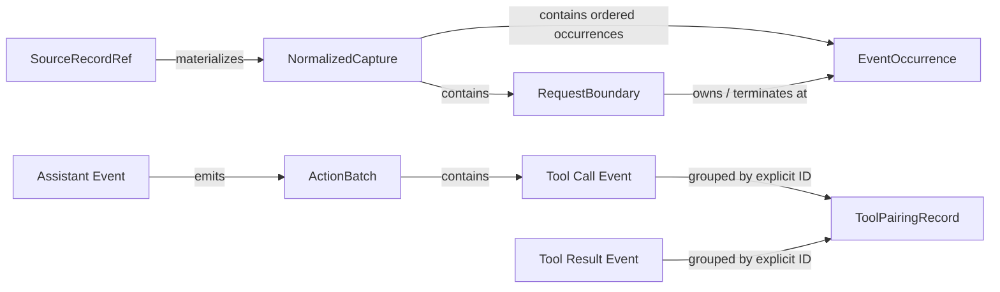

# R01 回流处理实施规格

版本：v3.0

日期：2026-09-01

状态：M1A、M1B 验收未通过；v3 候选契约等待全量重新验收

本文是 R01 回流处理的实施事实来源。项目背景见 [`background-and-goals.md`](background-and-goals.md)，总体阶段与下游边界见 [`overall-plan.md`](overall-plan.md)，开发纪律只引用 [`../AGENTS.md`](../AGENTS.md)。

## 1. 当前授权范围

当前开发会话只实现：

```text
M1A Source Adapter
+
M1B Structural Compiler
```

当前不实现：

- 跨 capture 的 Request/Capture Graph；
- QueryTurn、TaskEpisode 或任何 LLM 调用；
- 任务分布、环境暴露分布和难度画像；
- World、Truth、Reference、Verifier；
- Harbor、AGS 或模型 rollout。

现存 v2 R01 run 的物理与主要结构事实闭合，但正式结论已经撤销。v3 必须修复 typed payload、dataset slug 和异常 pairing 后重新留证；M1C 及之后阶段继续冻结，进入 M2 前还必须单独冻结并审核最小来源注解投影。

## 2. 冻结输入

```text
路径：/Users/wujian1/Downloads/seed2traj/return_data/four_batch/by-rubric/R01.jsonl
dataset_id：r01-four-batch-202607-v1
物理行数：1,683
字节数：560,481,884
SHA-256：3832d8aa4ecd577636ce67b56d8798d9fb6311662a7bbce65814e5e8d260d4d8
```

R01 是来源 cohort 和检索 rubric，不是业务 Domain。一条 JSONL 是一个规范化 capture 快照，不是 Session、用户请求或独立任务。

每条记录的顶层结构为：

```text
domain_meta
messages
meta
tools
```

`thread_id` 和 `account_id` 在全部记录中相等，共有 956 个值。它们只能作为候选比较分组，不能直接作为 Session、Episode 或 lineage ID。

## 3. 数据层级

```text
SourceRecord
    一条物理 JSONL 行

NormalizedCapture
    一个 restored_long 可见上下文快照

RequestBoundary
    source_request_ids 与 terminal_prefix_depths 给出的响应终点

Immutable Visible EventLog
    capture 内规范化可见消息的线性顺序

Derived Edges
    assistant decision、ActionBatch、tool call/result 等显式关系
```

EventLog 只表示数据中的规范化可见顺序。R01 全部声明 `representation=restored_long`，并包含 `tool_result_blocks_reordered` 修复记录，因此不能把 EventLog 声称为原始 wire order。

## 4. M1A：Source Adapter

### 4.1 命令行

```bash
traceforge trajectory compile \
  --input <R01.jsonl> \
  --dataset-id r01-four-batch-202607-v1 \
  --source-schema traceforge.restored-long-capture.v1 \
  --expected-sha256 3832d8aa4ecd577636ce67b56d8798d9fb6311662a7bbce65814e5e8d260d4d8 \
  --output <artifact_root>
```

M1 不提供模型、并发、resume 或兼容模式参数。

`source_format=jsonl` 只表示物理编码；`source_schema=traceforge.restored-long-capture.v1` 才表示单条记录的语义契约。`trajectory/source_adapter.py` 负责校验精确的 `domain_meta/messages/meta/tools` envelope 及 `representation=restored_long`，再交给不解释任意 JSON 的 Structural Compiler。

`dataset_id` 是会进入 source/artifact manifest 和公共 attrition report 的控制字段，必须是 1–128 字符的小写 ASCII slug：首尾为字母或数字，内部只允许 `[a-z0-9_-]`。URL、路径、query、fragment、凭据形式和其他字符一律拒绝，错误信息不得回显原值。compiler 在创建 artifact 前校验，validator 对已发布 manifest 和 report 再次校验同一冻结规则。

这些字段是版本化 schema，不是对 R01 样本值的硬编码。路径、dataset ID、digest、rubric、Domain、模型名、工具名和统计值不参与 adapter 分支。不支持的 `source_schema` 在读文件和创建 staging 前失败；已声明 schema 中的单条坏 envelope 进入该行 `QUARANTINED` 终态。

### 4.2 流式读取

输入必须以二进制方式读取：

1. 第一遍在扫描前后校验文件 stat，并流式计算数据集摘要、字节数和物理行数；
2. 校验 expected digest；
3. 第二遍重新打开文件，先确认 stat 与第一遍结束时一致；
4. 逐行生成 offset、length 和 digest 账本，同时进行严格 JSON 解析与 capture 编译，并重新计算整文件摘要、字节数和行数；
5. 第二遍结束后再次校验 stat、数据集摘要、字节数和行数；
6. 单行解析或结构错误写入该行终态，不丢弃来源，也不伪造正常 capture/event。

实现只在内存中保留数据集级扫描结果和当前正在处理的物理行/capture；逐行账本直接流式落盘。不得把整个 560 MB 文件、全部原始行或全部解析对象载入内存。

### 4.3 来源引用与稳定 ID

dataset digest 覆盖原始文件全部字节；line digest 覆盖物理行全部字节，包括行末换行。

```text
source_record_id = sha256(
  "source-record-v1\0"
  + dataset_id + "\0"
  + dataset_sha256 + "\0"
  + 1-based line_number + "\0"
  + line_sha256
)
```

绝对路径不参与 ID，移动输入文件不得改变稳定对象标识。

实际 `SourceRecordRefV1` 字段固定为：

```yaml
schema_version:
source_record_id:
dataset_id:
dataset_sha256:
line_number:
byte_offset:
byte_length:
line_sha256:
ingestion_status: PARSED | QUARANTINED
parse_error: null | {code, message}
```

`parse_error` 只描述严格 JSON 摄取错误。JSON 已成功解析、但不满足 capture 结构契约时，来源记录仍为 `PARSED`，结构错误进入对应的 `CaptureQuality.processing_error`。

### 4.4 确定性序列化

- UTF-8；
- key 排序；
- 紧凑分隔符；
- 禁止 NaN 和 Infinity；
- 不改变原始字符串；
- 每条 JSONL 使用一个 LF 结束；
- 文件通过临时文件、`fsync` 和原子替换发布。

严格 JSON 与派生结构同时设置确定性资源边界：来源 JSON 嵌套深度上限为 256，派生隐私变换深度上限为 80，超限只隔离当前物理行并继续处理下一行。整数最多 640 位；浮点数只有在二进制浮点往返不会改变其十进制语义时才接受。下溢、超出安全整数语义的浮点数和超长整数使用稳定错误码拒绝，不得静默改值，也不得依赖进程级 `int_max_str_digits` 配置。

`run_receipt.json` v2 只保存运行时间、时长、Python/TraceForge 版本、run ID、artifact manifest 摘要、最小 Git provenance `{available, commit, tree, dirty}` 及完成时一致性标志。它不得保存输入/输出绝对路径、文件名或 diff 内容，也不得影响业务 artifact digest。

### 4.5 通用实现与 R01 oracle 的边界

核心 compiler 接受调用方提供的 JSONL、`dataset_id`、`source_schema` 和可选 expected SHA-256，不内置 R01 路径、摘要、行数或统计值。validator 同样不内置任何来源 profile，只根据已发布 run 重算通用结构与一致性事实。

本文件第 2 节和第 7 节的 R01 数字只作为文档化的外部验收 oracle，不参与来源解析、结构编译、稳定 ID 或通用一致性判断。若以后需要机器执行 oracle 对比，必须由调用方显式传入独立 expectation/profile，不得把特定数据常量写入核心或通用 validator。

## 5. M1B：Structural Compiler

### 5.1 RequestBoundary

每个 capture 必须独立校验：

```text
len(source_request_ids)
= len(terminal_prefix_depths)
= source_request_count
```

同时要求：

- depths 严格递增；
- 最后一个 depth 等于 `len(messages)`；
- 每个 boundary 落在 assistant message；
- `capture_id` 等于最后一个 `source_request_id`。

已确认全量 R01 包含 9,561 个 boundary，全部满足这些不变量。

首个 boundary 的 terminal assistant 之前的消息标为 `PRE_FIRST_OBSERVED_TERMINAL`。首个 terminal assistant 本身归属于第一个 `OBSERVED_REQUEST_WINDOW`。不能为更早的可见 assistant 伪造 request ID。119 条 compaction 记录只有 capture 级 count/hash，只能保存为 `UNLOCALIZED_COMPACTION_EVIDENCE`，不能推断具体消息位置。

### 5.2 EventOccurrence

事件类型固定为：

```text
SYSTEM
USER
ASSISTANT_MESSAGE
TOOL_CALL
TOOL_RESULT
```

每个事件保存 occurrence ID、source/capture 引用、JSON pointer、消息和调用位置、request boundary、typed content、`visible_payload_utf8_byte_length`、`visible_payload_sha256` 和 `integrity_status`。

`visible_payload_utf8_byte_length` 是去除 reasoning 审计摘要后的可见 payload 经 canonical JSON 编码后的 UTF-8 字节数，不是原始 JSONL 行长，也不是 assistant content 字符数。`visible_payload_sha256` 对同一份 canonical bytes 求摘要。M1 v3 只有在该事件的可见 payload 已完整映射时才产出事件，因此 `integrity_status` 固定为 `COMPLETE`；它不表示原始 wire 日志完整、任务完成、工具成功或不存在 compaction。

下游只能通过 `event_payload.py` 的 typed reader 读取五种 event payload，不能各自重新解释 JSON。reader 对普通 TEXT 与无效 JSON 文本独立重算 UTF-8 长度和 SHA-256；脱敏文本只接受严格 privacy envelope 并核对内外审计字段。tool arguments 的 pointer 必须精确为 `/messages/<index>/tool_calls/<sub_index>/function/arguments`，validator 还要将两个 index 与 event 位置比较。任一字段集合、类型、审计值或绑定不匹配都必须 fail-closed。

assistant message 和它的 tool calls 拆成不同事件，通过 tool call payload 的 `assistant_event_id` 关联。同一个 assistant decision 中的一个或多个 tool call 形成一个 `ActionBatch`。来源没有明确并行证据，因此 `execution_semantics=UNKNOWN`；result 到达顺序不能用来推断 tool call 的并行或因果顺序。

list 型 content 必须保留 content block，禁止转成字符串。所有派生 artifact 都不得输出 Base64 Data URL；大小写、参数空白、换行、百分号转义以及 RFC 2231 参数形态由同一个结构扫描器识别，只允许保存 mime、长度、hash 和原始 JSON pointer。普通文本中的孤立 `;base64,` 不是 Data URL。compiler 与 validator 共用这一条规则，公共报告连逐条摘要也不输出，只保存聚合计数。

### 5.3 reasoning_content

旧回流任意层级的 `reasoning_content`：

- 原文不复制进 EventLog；
- 不参与 lineage、任务识别、环境画像、难度、GT 或模型输入；
- 只保存存在性、长度、SHA-256 和原始 JSON pointer；
- 原文仅通过受控的原始行引用保留审计能力。

派生 payload 中虽然可以保留字段名 `reasoning_content`，其值只能是固定摘要对象 `{present, utf8_byte_length, sha256, source_json_pointer}`，不是原始 reasoning。递归 sanitizer 处理 content block、tool definition、tool arguments、result 和 vendor extension；内部隐私 envelope 使用保留标记并对来源中的同名对象转义，不能与普通业务对象碰撞。事件的 visible byte length/hash 和 tool catalog identity 明确排除 reasoning 摘要，隐藏原文变化不得改变这些可见指纹。

这与下游 Harbor 的无损采集不冲突。Harbor 可以保存新 rollout 实际返回的 thinking，但任何任务生成、Truth 和 Verifier 都不得依赖它。

### 5.4 Tool call/result pairing

只使用显式 `tool_call_id`，不得按相邻位置猜测。状态固定为：

```text
MATCHED_ONE_TO_ONE
RESULT_NOT_OBSERVED
DUPLICATE_CALL_ID
DUPLICATE_RESULT
ORPHAN_RESULT
NAME_MISMATCH
RESULT_BEFORE_CALL
INVALID_CALL_ARGUMENTS
```

所有 call 和 result 都以 occurrence 保存，禁止使用单值字典覆盖重复 ID。`RESULT_NOT_OBSERVED` 只表示当前 capture 未观察到结果，不能解释成工具没有执行。

只有 call/result 数量均为一、工具名一致、result 不早于 call 且 call arguments 有效时，才填写 `matched_call_event_id` 与 `matched_result_event_id` 并标记 `MATCHED_ONE_TO_ONE`。任一异常或重复组只能保存完整 occurrence 集合和异常状态，两个 `matched_*` 字段必须为 `null`，不得伪造精确配对。

### 5.5 多维质量状态

禁止产生一个全局 `valid`：

```text
processing_status:
  COMPLETE | PARTIAL | QUARANTINED

boundary_status
tool_pairing_applicable
tool_pairing_statuses[]
tool_schema_status
terminal_status
privacy_status
compaction_status
NormalizedCapture.input_truncation_status:
  OBSERVED_TRUNCATED | OBSERVED_NOT_TRUNCATED | UNKNOWN
processing_error
reason_codes[]
```

`leaf_response_status=completed` 只说明捕获响应结束，不能解释为任务完成或回答正确。

`processing_status` 只描述编译器是否忠实产出可见结构，不评价原轨迹质量。缺失 observation、schema conflict、inferred schema、pending tool call、compaction 和 input truncation 都进入独立质量轴；只要可见结构完整落盘，仍为 `COMPLETE`。输入没有明确截断证据时必须为 `UNKNOWN`，不能伪报“未截断”。JSON 或关键 boundary envelope 无法可信编译时为 `QUARANTINED`，且不得产出伪造 capture/event。`PARTIAL` 只保留给未来确有安全子树可落盘、但当前契约明确允许缺失另一子树的情况；M1 v3 不用它掩盖异常。

工具目录只验证可冻结的最小结构：definition 是对象、`type=function`、function 是对象、name 为非空白字符串、parameters 是对象。`catalog_input_valid` 记录该来源结构是否满足最小条件；它不等于完整 JSON Schema 校验，也不证明生产环境真实提供了该工具。

`processing_error` 在 `COMPLETE` 时必须为 `null`。在 `QUARANTINED` 时保存稳定 `code` 和诊断 `message`：严格 JSON 错误与 `SourceRecordRef.parse_error` 对齐；capture 结构错误使用 `CaptureCompileError` 的 reason code。`reason_codes` 保存同一稳定 code，供聚合和筛选使用。错误终态只写 `source_records.jsonl` 与 `capture_quality.jsonl`，不得伪造 `NormalizedCapture`、boundary 或 event。

### 5.6 Capture 内部属性图

M1B 已经建图，但不引入图数据库，也不重复输出一份可能失配的 graph dump。规范化表是节点，稳定 ID 和外键是边：



其中：

- `EventOccurrence.sequence_number` 表示规范化可见顺序；
- `RequestBoundary.terminal_event_id` 与 `EventOccurrence.request_boundary_id` 表示 boundary 边；
- `ActionBatch.assistant_event_id/tool_call_event_ids` 表示 decision 边；
- `ToolPairingRecord.call_event_ids/result_event_ids` 保留全部 occurrence；
- 所有节点都可经 `source_record_id` 和 `source_json_pointer` 回到原始物理行。

M1C 只新增跨 capture 的 lineage edge，不重写这些节点。

## 6. M1A、M1B 输出

```text
artifacts/r01/<content_addressed_run_id>/
├── source_manifest.json
├── private/
│   ├── source_records.jsonl
│   ├── captures.jsonl
│   ├── request_boundaries.jsonl
│   ├── event_occurrences.jsonl
│   ├── action_batches.jsonl
│   ├── tool_pairings.jsonl
│   ├── tool_catalogs.jsonl
│   └── capture_quality.jsonl
├── reports/
│   └── attrition_report.json
├── artifact_manifest.json
└── run_receipt.json
```

`private/` 可以保存 system、user、assistant 可见内容、tool arguments 和 observation 的完整 typed 形态，但不得保存 reasoning 原文。`reports/` 不得包含原始 ID、原文、路径、URL、data URL 或敏感 literal。

`source_manifest.json` 和 `artifact_manifest.json` 都保存 `source_schema`，内容寻址 run ID 也绑定该字段，防止同一原始字节被不同语义契约误用为同一个 run。

NormalizedCapture、EventOccurrence、ActionBatch、ToolCatalog、CaptureQuality 和 AttritionReport 保持 v2；严格 matched 语义发生变化的 ToolPairingRecord 升为 v3，compiler contract 升为 `trajectory-compiler-m1ab-v3`。来源账本、RequestBoundary 与 ArtifactManifest 的字段未改变，继续使用各自 v1 schema。稳定 ID 的身份字段和公式也未改变，因此 ID namespace 继续使用 v1；schema 版本和身份算法版本不得混为一谈。

`artifact_manifest.json` 的 `files` 只列出十个确定性业务文件：`source_manifest.json`、八个 `private/*.jsonl` 和 `reports/attrition_report.json`。它不列出自身，以避免自引用摘要；也不列出含时间和运行环境的 `run_receipt.json`，避免非确定信息改变业务清单。`run_receipt.json` 反向保存 `artifact_manifest.json` 的 SHA-256，并记录 Git commit/tree/dirty 状态；正式运行必须在结束时确认 Git 来源没有变化。独立 validator 仍会检查这两个文件以及完整目录 inventory；“不进入 files”不表示不校验。

真实输出不进入 Git。Git 只保存重新构造的虚构 fixture。

## 7. 全量验收基线

### 7.1 独立 validator

编译成功后，使用 CLI 输出的内容寻址 run 目录执行：

```bash
uv run python scripts/validate_m1_run.py <content_addressed_run_dir>
```

validator 独立读取已发布文件，不调用 compiler 重建期望结果。它从事件、边界和目录本体重算 boundary ownership、event 顺序与 scope、ActionBatch 成员、严格 pairing occurrence/status/matched 语义、tool catalog 最小结构与状态、全部 quality 轴/reason code 以及公共聚合计数；同时校验 dataset slug、typed text 审计、arguments pointer/event 绑定、目录 inventory、manifest digest/size/record count、稳定 ID、可见指纹、递归隐私和 `run_receipt` 绑定。自报 payload 元数据、quality 或 report 即使同步篡改也不能覆盖这些可重算事实。该命令对所有同契约 run 使用同一逻辑，不包含 R01 分支或常量。

validator 的信任边界只到已发布来源账本和派生产物。对于已解析但无法仅由派生产物重现的 adapter 结构错误，只允许核对带来源证明的 `processing_error`，不能把它表述为 validator 独立恢复了原始语义。

### 7.2 R01 外部 oracle 与 v2 结果

下列数字不参与 compiler 分支或通用 validator 逻辑。它们最初来自 v1 正常路径，本次已经由 v2 全量重编译和独立 validator 重新确认；完整执行证据见验收报告：

```text
physical lines                   = 1,683
parsed captures                  = 1,683
request boundaries               = 9,561
unique requests                  = 6,301
system events                    = 6,220
user events                      = 14,407
assistant message events         = 48,667
tool call events                 = 56,424
tool result events               = 50,140
all event occurrences            = 175,858
pre-first scoped events          = 127,746
request-window scoped events     = 48,112
action batches                   = 42,318
tool pairing records             = 56,424
strict one-to-one pairings       = 49,800
captures with unobserved results = 1,248
unobserved call IDs              = 6,474
duplicate result groups          = 150
extra result occurrences         = 190
tool definitions                 = 18,566
tool definition conflicts        = 349
captures with inferred schemas   = 280
inferred tool name annotations   = 566
compaction captures              = 119
truncated input captures         = 35
unknown input truncation         = 0
terminal text outcomes           = 472
terminal tool-call pending       = 1,211
compiler COMPLETE                = 1,683
compiler PARTIAL                 = 0
compiler QUARANTINED             = 0
```

完成条件：

- 1,683 条 source line 全部有结构终态；
- 两遍扫描的逐行账本、文件 stat、总字节数和 digest 闭合；
- 两次运行的确定性 artifacts 字节一致；
- 冻结 R01 全量运行峰值内存低于 512 MiB，且实现不保留全部原始行或全部解析对象；
- 私有 artifact 与公共报告物理分离；
- 派生内容不包含 reasoning 原文；
- 对重签后的 boundary、pairing、quality/report 语义破坏必须报错；
- 深层 JSON、递归 reasoning、Data URL 变体和不可忠实表示数值必须有稳定逐行终态；
- 测试、静态检查和全量不变量全部通过。

## 8. 后续阶段边界

### 8.1 M1C：Request/Capture Graph

M1C 启动前必须先冻结以下硬门：

- `candidate_group_id` 只允许标记为 `BLOCKING_HINT_ONLY`，不能直接成为 lineage 证据；
- Grade-A 显式关系不得受候选组边界限制；
- M1C validator 必须独立重算候选组公式；
- `raw_request_hash` 只有满足届时冻结的格式契约才可作为证据，否则一律为 `UNKNOWN`。

高可信 Grade A 关系来自共享 source request、显式 request successor、相同 raw request hash 或完整重复 capture。

`NORMALIZED_VISIBLE_PREFIX_OF` 只能作为 Grade B 投影关系。它不能单独用于因果 lineage、硬去重或主分布；只共享 system、thread/account 或时间接近时不建边。

### 8.2 M1D：QueryTurn

M1D 先确定性区分真实 query、附件上下文、Harness 包装、系统注入、工具反馈和中断控制，只输出 `UserBlock`、`QueryTurn` 与结构性 `ThreadTurnGraph`。

### 8.3 M2：TaskEpisode 与画像

进入 M2 前必须先提供最小、带来源的 `SourceAnnotationProjection` 或只读 `SourceResolver`，只暴露经审核的 task/rubric/risk 先验。M2 不得绕过 M1 artifact，按绝对路径私下重新解析原始 JSONL。

M2 才允许通过两次独立、封闭枚举的语义提取建立：

```text
CONTINUES
REFINES
DEPENDS_ON
CORRECTS
CANCELS
BRANCHES_FROM
NEW_TASK
AMBIGUOUS
```

两次结果和证据不一致时必须 `ABSTAINED`，不得重复调用直到得到一致答案。自动画像完成后，由项目负责人一次性冻结首个业务 Domain/task family，不做逐样本人工 review。

### 8.4 Harbor 交接

正确时序是：

```text
TaskWorldCandidateRevision
→ G0–G5 + G7
→ Public/Control 物理分包
→ RunnableTaskWorldCandidateBundle
→ Harbor rollout + independent evaluation
→ G6
→ CertifiedTaskWorldRelease
```

Harbor smoke 与 R01 处理可以并行开发，但在上述候选包契约冻结前不得拼接。
