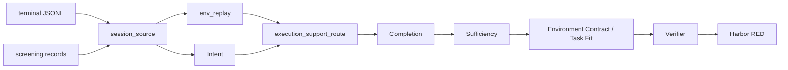

# reconstruct run 阅读地图与清理清单

以源码为准。筛选记录兼容入口是 reconstruct run；R04/R05 当前逐条入口是 reconstruct raw-run。详细 raw 主链见 raw-session-pipeline.md。轨迹编译 / lineage / query-turns / source-projection 已删除。

READY 仍表示：Harbor 对**初始 workspace** 做出 RED（nop FAIL / oracle PASS / mutation FAIL）。没有 RED 不能把交付标成 READY。

`reconstruct source` 只抽源、不调模型。`screening run` 产出 records，供 `reconstruct run --records` 使用。

## 当前目标与完成标准

优先从真实 terminal 的文件任务跑通单条闭环，再扩大候选数量。第一条样本应有明确文件或命令行为验收、可恢复的初始上下文和可安装依赖；不围绕只读报告样本先扩展聊天输出协议。

- 环境重建通过：恢复用户目标 `q`，得到足以解题但尚未解题的环境 `E`。
- 重建认证通过：隐藏验证器实际运行；初始环境缺失能力测试失败、保护性测试通过，Harbor NOP / oracle / mutation 校准通过，manifest 为 `READY`。
- 完整端到端通过：真实 Hermes 在该环境解题，至少两次 rollout 满足已有验证和质量门禁，保留轨迹、verdict、reward 与 cleanup 证据。仅 `READY` 不证明解题复验成功。

论文 §3.1 对应 replay / completion / sufficiency。论文附录 D 的验证器要求包括初始环境 RED；项目额外加入 Harbor oracle / mutation 校准及两次解题复验。论文原始 Intent Recovery 实验未采用 agentic verifier 过滤，不能把项目这些额外要求全部说成论文原文要求。

## 主链

```text
terminal JSONL + screening records.jsonl
  → session_source（reconstruction_source）
  → env_replay（Stage1，无模型，按路径回放 bE0）
  → Intent（q + environment_bindings）
  → execution_support_route（Intent 后重算）
  → Completion（有回放则 from_replayed，否则 from_default_empty）
  → Sufficiency（workspace_sufficiency）
  → Environment Contract / Task Fit（环境事实与拟合任务分开）
  → Verifier（仅当 allow_file_verifier）
  → Harbor RED（--execute-red）
  → Hermes rollout（--execute-rollout，只写 SFT，不改 READY）
```

每次重建还会在 `tasks/<task_id>/task_environment_pair.json` 保存论文中的
`q/E` 对：`q` 只投影已通过 Intent 的用户目标、验收义务和环境绑定，`E` 记录回放证据、部分文件、 withheld 变更、候选和验证状态。Intent 未恢复时只写 `unrecovered` 审计记录，不生成执行指令。根目录的 `stage_metrics.json` 汇总 Intent、Completion、Sufficiency、Verification、路由和停止原因，便于区分“未运行”“审计态”和“真正通过”。

环境拟合是 Sufficiency 之后的门禁，不把“补全出了文件”当成“任务一定可完成”。
`environment_contract.json` 记录静态缺口、workspace hash 和只读沙盒探针；`task_contract.json`
保留从 terminal 轨迹恢复的原始用户目标；`task_fit.json` 逐条记录验收义务与环境能力的映射。
缺失的 XML include、必要 FILE 绑定或未知初始状态会产生 `SKIPPED_UNRECONSTRUCTABLE`，当前候选停止并继续后续候选；模型超时、沙盒故障和契约错误分别保留为 `INFRA_ERROR` 或 `PIPELINE_ERROR`，不伪装成不可重建。

只有环境静态检查通过且 load/reset/dependency 探针有真实收据时，拟合 agent 才能把明确的任务冲突标为 `INCOMPATIBLE`。变体必须从补全环境、原始任务契约和可复现的 `task_conflict` 证据共同生成，仅修改已冲突义务，产物状态先为 `PROPOSED`；它会重新经过 Sufficiency、Verifier、Harbor RED 和真实 Rollout，通过后才可能成为 `READY_VARIANT`。缺失环境资产时不生成变体，原任务和变体的 provenance 始终分开。

SFT 只从真实 rollout 的 `quality_gate`、trial、cleanup、轨迹和内容证据生成；缺少泄漏、可复现或奖励证据会进入 `REVIEW`，不会因为旧的 `sft_eligible` 标志而放行。



编排在 [`src/traceforge/cli.py`](../src/traceforge/cli.py) → [`eligible_reconstruction.py`](../src/traceforge/reconstruction/eligible_reconstruction.py)。

`--sandbox` 才把文件 / pytest 打到 AGS。默认是宿主机 Hermes 代理，不是论文里的容器 Agent。缺 `AGS_API_KEY` / `E2B_API_KEY`（或 `config.yaml` 里的 key）直接失败，不要假装已经容器验收。

## 按这个顺序读源码

每文件只抓括号里的点。

**编排**

- [`eligible_reconstruction.py`](../src/traceforge/reconstruction/eligible_reconstruction.py)：筛选回放 → Intent → `_task_result` 重算路由 → Completion → Sufficiency → Verifier。有回放文件就走 `TERMINAL_FILE` 且 `allow_completion=true`。`allow_file_verifier` 只看 Intent 是否给出了明确 FILE 义务；为假时直接 `NO_FILE_ACCEPTANCE`，Harbor 不会启动。`TREE_TOO_THIN` 已从当前路由去掉。
- [`session_source.py`](../src/traceforge/reconstruction/session_source.py)：原始行 + 筛选记录 → `tool_timeline` / user texts。

**环境（Stage1，无模型）**

- [`env_replay.py`](../src/traceforge/reconstruction/env_replay.py)：按路径回放。具名 dump、只读探测、`cl /Zs` 语法检查、真写屏障都在这里。
- [`environment_bindings.py`](../src/traceforge/reconstruction/environment_bindings.py)：FILE / NON_FILE。`derive_binding`、`FILE_BINDING_PATHS`、listing 丢路径。NON_FILE 不得带 path。

**各阶段实现与契约**

- Intent：[`intent_recovery.py`](../src/traceforge/reconstruction/intent_recovery.py) + [`roles.py`](../src/traceforge/reconstruction/agents/roles.py) 的 `INTENT_ROLE`。看 `deepen_requires_file`、`_file_obligation_ready`、`FILE_OBLIGATION_REQUIRED`。义务证据只能是 `user:<message_index>`。
- Completion：[`workspace_completion.py`](../src/traceforge/reconstruction/workspace_completion.py) 的 `complete_from_replayed` / `complete_from_default_empty`。
- 写路径：[`session.py`](../src/traceforge/reconstruction/agents/session.py) 的 `workspace_relpath` / `_write_file`；[`runtime.py`](../src/traceforge/reconstruction/agents/runtime.py) 里 `os.chdir(hermes_scratch)` 和 `path_aliases`。
- 沙盒：[`sandbox.py`](../src/traceforge/reconstruction/agents/sandbox.py)、[`container_verification.py`](../src/traceforge/reconstruction/container_verification.py)。
- Sufficiency：[`workspace_sufficiency.py`](../src/traceforge/reconstruction/workspace_sufficiency.py)。活跑用这个。
- Verifier / Harbor：[`verification.py`](../src/traceforge/reconstruction/verification.py)、[`verifier/synthesis.py`](../src/traceforge/verifier/synthesis.py)（oracle 静态门按**写入目标**判断）、[`verifier/bundle.py`](../src/traceforge/verifier/bundle.py)（`solve.sh` 仍把 oracle 拼进 `#!/bin/sh`）。

**已知活跑卡点（改代码时对着看，本文不改逻辑）**

1. Intent：当前 prompt 要求保留用户原始目标和意图类型，并为每条验收义务显式给出一个 binding。完整环境不足时不得把实现/修复/评审改写成计划；缺 binding 或 FILE 路径不充分会进入 REVIEW。纯只读评审、解释和报告可以保持 NON_FILE，不再被强制伪造 FILE。
2. Replay：OpenCode filePath、<path>/<content> 包装、PowerShell 行号和只读 rg | sed 已纳入解析；未知写操作仍建立 barrier，后续内容只保留为私有证据，Completion 的证据索引、洞卡片和目录解析都会过滤这些事件。
3. Completion：目标 FILE 路径必须是真实上下文；全是 skip/pass 的测试骨架会以 `BINDING_PATH_TEST_SKELETON` 进入 REVIEW。仍需观察模型是否把写入落在 workspace，而不是 hermes_workspace；看 workspace_relpath、cwd 和 completion.json 的 evidence refs。
4. 全 NON_FILE 时 allow_file_verifier=false，管线可完成 Completion/Sufficiency，但在文件 Verifier 前以 NO_FILE_ACCEPTANCE 保持 REVIEW；这属于输出型验收尚未接入独立回执协议。
5. terminal selector 只产出 CANDIDATE_ONLY。当前本地 R04/R05 是截断采样（R04 297/6535、R05 336/1694 物理行，sha 不匹配），不能宣称覆盖上游全量；模型证据超过预算时 fail-closed，不删除中间事件。
6. 活跑可用 `TRACEFORGE_MODEL_TIMEOUT_SECONDS` 限制单次模型窗口，`TRACEFORGE_AGENT_MAX_ITERATIONS` 限制单个 Hermes 角色的总轮数；默认不改变角色预算，异常复跑建议显式设置，避免外部模型无响应拖到总进程超时。
7. 不要发明源码、不要写解题、不要写目标测试。Intent 只引用用户原文。web_search 只给 Completion，且不得把检索到的源码写进用户路径。

## 当前验证证据（2026-09-20，terminal 真实活跑与当前提交）

| 证据 | 已确认 | 不能据此确认 |
| --- | --- | --- |
| 离线回归 | 511 passed、5 skipped、5 warnings | 真实模型或 Harbor 全链路成功 |
| 真实 R04 L3 v10（GPT） | source/replay 恢复 15 个文件；Completion READY | Sufficiency 为 REVIEW/INSUFFICIENT（大量源码仍是 partial），未进入 Verifier/RED/rollout |
| 真实 R04 L4959（GPT） | source/replay 恢复 2 个文件；Intent READY；sandbox 初始化成功 | Completion 为 REVIEW（依赖上下文不足，停止在 completion），未进入 Sufficiency/Verifier/RED/rollout |
| 真实 R04 L41 历史活跑 | Intent / Completion / Sufficiency READY | Verifier 为 REVIEW，RED 未闭合 |
| terminal 合成 fixture | 主编排可到 verifier bundle / PENDING_EXECUTION | 使用模型替身和本地执行器，非真实 terminal 交付 |

项目内 R04/R05 副本仍被截断；distribution.json 指向的完整上游文件可读且哈希一致。可直接对完整上游做只读筛选，不必先覆盖本地副本。全量候选索引为 7,586 条（R04 6,069、R05 1,517），这里只证明存在 terminal 工具调用，仍需模型筛选。

`scripts/check_reconstruct_e2e.py` 是已有产物的外部审计脚本，不是执行入口；当前版本会严格检查 source、Intent、Completion、Sufficiency、Verifier、RED、secret hygiene 和 Harbor rollout schema。两条本轮真实 terminal 产物的审计结果均为 `pipeline_ok=false`，这是证据不足时的安全失败。主编排是 `eligible_reconstruction.py`。

## 对照产物（只读）

看一份产物时只盯：`reconstruction_manifest.json` 的 `stopped_at` / `execution_support_route` → `intent/intent.json` 的 `environment_bindings` → `tasks/*/completion/completion.json` → 若有则 `verification/verification.json`。

- [`artifacts/eligible-live/L22-e2e-5/`](../artifacts/eligible-live/L22-e2e-5/)：历史活跑对照产物，当前状态为 REVIEW。Intent READY、三条全 NON_FILE；Completion `MODEL_DECISION_REVIEW`。
- [`artifacts/eligible-live/L22-e2e-3/`](../artifacts/eligible-live/L22-e2e-3/)：旧规则下走到 Verifier 的历史对照，当前状态为 REVIEW。

`artifacts/` 已被 gitignore，不会进仓库。

## 活跑命令

下面只作为需要凭据和 AGS/E2B 的参考命令，不属于普通回归步骤：

```text
export HERMES_HOME=/mnt/afs_toolcall/wujian1/Projects/tokenhub_data_model_eval/R01/hermes-agent
RECORDS=/tmp/traceforge-l22-v10-wrapped/records.jsonl

PYTHONPATH=src python -m traceforge reconstruct run \
    --input return_data/four_batch/by-rubric/R01.jsonl \
    --records "$RECORDS" \
    --line-number 22 \
    --output artifacts/eligible-live/L22 \
    --config config.yaml \
    --channel claude \
    --model-name claude-opus-4-6 \
    --hermes-home "$HERMES_HOME" \
    --sandbox \
    --execute-red
```

加 `--execute-rollout` 只做解题复验。`config.yaml` 只在部署机，已 gitignore。

## 仍有效的专题文档

- 筛选：[reconstruction-screening-plan.md](reconstruction-screening-plan.md)、[reconstruction-screening-rubric.md](reconstruction-screening-rubric.md)
- 模型通道：[model-gateway-config.md](model-gateway-config.md)
- Harbor 计划适配：[harbor-ags-boundary-adapter.md](harbor-ags-boundary-adapter.md)
- 失败分析复用：[failure-analysis-reuse.md](failure-analysis-reuse.md)

## 清理清单

本次已删除过时文档，见上一节。下面是磁盘与代码，**不在这次提交里删产物**。

**可删（误文件 / 缓存，不影响主链）**

- `.pytest_cache/`、`.ruff_cache/`
- `artifacts/research-goal-audit-20260918-regression.log`（若还在）

**体积大、可再生成；删前先确认不需要对照**

- 各次活跑里的 `hermes_scratch/`、`sandbox_workspace/`、`verification/agent/round-*/_pytest_runtime/`。保留同目录 `*.json` 即可复盘。
- `artifacts/eligible-live/path-validation-20260917/`：L33/L37/L49 路径验收，不是 L22 主对照。
- `artifacts/eligible-live/run-live/`：分段 Completion 实验。
- `/tmp/run_l22_completion_grounded.py`、`/tmp/traceforge-l22-*`：宿主机临时脚本和旧 records。活跑命令仍可能引用 wrapped records，删前先看启动命令。

**保留**

- `L22-e2e-3`、`L22-e2e-5` 的 manifest / intent / completion / replay JSON。
- `return_data/`、`config.yaml`、`tests/`、`src/traceforge/reconstruction/` 主链。
- 筛选 records（`/tmp/traceforge-l22-v10-wrapped/records.jsonl` 或 v9 records）。

**勿当死代码删**

- `trajectory/` 里剩下的 `json_codec` / `privacy` / `artifacts`：筛选、Harbor、重建源仍在用。
- `failure_analysis/`、`requery/`、`screening/`：有 CLI。
