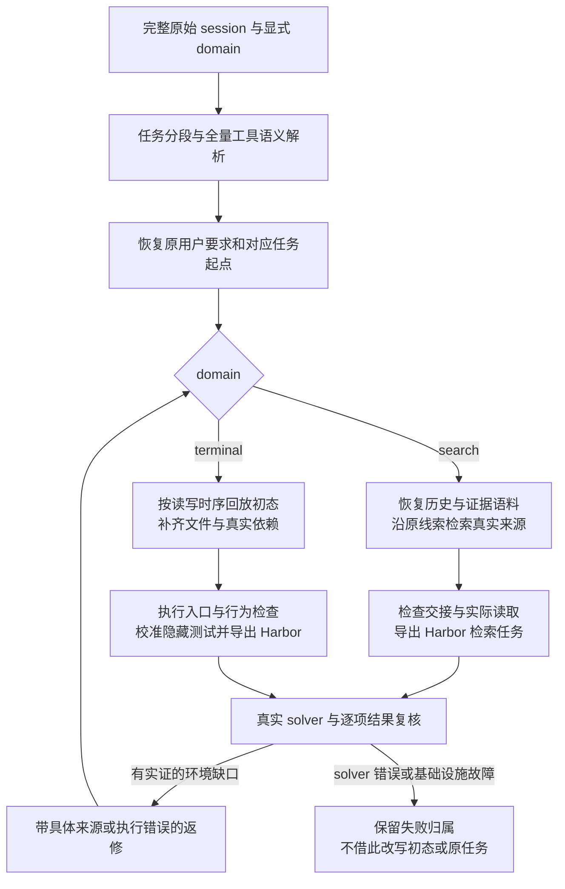

# 重建源码阅读地图

本页只维护模块导航和契约。运行状态见 [当前状态](current-status.md)，逐阶段流程见 [原始会话流程](raw-session-pipeline.md)。开发约束以 [AGENTS.md](../AGENTS.md) 为准。

## 框架与返修方向

目标是最大限度利用完整原始 session，恢复合理、忠实的任务及可解的对应环境。重建者首次补全请求直接获得所有消息和顶层字段，timeline 保留来源与时序；solver 获得交付的任务、初态和工具。两者输入边界分别维护。初态以分段后该任务的第一条用户消息为起点，同任务中途答案只供重建参考；独立后续任务可以依赖起点之前的真实产物。

共享的是原文、来源契约和错误记录，不是同一套环境判定。search 的缺口是资料、版本、历史或检索能力；terminal 的缺口是初态文件、依赖、接口或运行行为。每次修改后重新执行受影响的检查；相同候选和同一诊断不重复生成。格式错误回到对应模型修正，服务拒绝需保留具体参数/模型原因，不能伪装成“语义不合格”。通道重试复用Hermes原有退避；恢复失败阶段时保留既有作者会话和产物，不重放已完成的阶段。

研究者给出的 READY/COMPLETE 是阶段意见。环境恢复程度、Harbor 包可运行、solver 回答正确分别记录；当前未闭合的部分只以[真实运行状态](current-status.md)为准。

## 参考依据与取舍

- AgenticFoundry 的 researcher 在读完轨迹后持续编写、执行并修订原生任务包，值得借鉴的是保留研究状态与真实执行反馈。本项目恢复原任务，不引入其新题生成、难度与新颖性目标；本地参考目录保持只读。
- [Harbor 官方任务结构](https://docs.harborframework.com/core-concepts/tasks/overview)明确分离 instruction、environment、solution 和 tests；沿用交付契约，导出成功与实际 trial 分别记录。
- [SWE-smith](https://arxiv.org/abs/2504.21798)从真实代码库建立执行环境并通过测试构造任务。这里参考真实环境和执行证据的约束，不移植自动制造缺陷的流程。
- [Open Deep Research 实现](https://github.com/huggingface/smolagents/blob/main/examples/open_deep_research/run.py)区分网页浏览与文件读取；本轮真实缺陷也要求将 PDF 从普通网页抓取路径分开。[pypdf 的提取边界](https://pypdf.readthedocs.io/en/stable/user/extract-text.html)说明文本层读取不包含 OCR 和视觉语义，因此交付保留空页与范围声明。

## 入口与编排

| 文件 | 职责 |
| --- | --- |
| [cli.py](../src/traceforge/cli.py) | `reconstruct raw-run`、Harbor 计划/执行/读取入口 |
| [raw_session.py](../src/traceforge/reconstruction/raw_session.py) | 原始 session 的 span 分段、任务覆盖与用户消息引用 |
| [session_parser.py](../src/traceforge/reconstruction/session_parser.py) | 模型理解完整原文、系统消息和工具协议，校验解析结果的原始引用 |
| [session_source.py](../src/traceforge/reconstruction/session_source.py) | 原始行读取、完整作者输入、消息视图和调用/返回索引 |
| [pipeline.py](../src/traceforge/reconstruction/pipeline.py) | 共用编排：Intent、Replay/路由、候选、充分性、任务拟合、验证与执行门禁 |
| [session_inventory.py](../src/traceforge/reconstruction/session_inventory.py) | 冻结输入和逐条 inventory 的完整性核对 |
| [prepare_session_batch.py](../scripts/prepare_session_batch.py)、[run_session_batch.py](../scripts/run_session_batch.py) | 批次准备、顺序执行与最终清单检查 |
| [run_config.py](../src/traceforge/reconstruction/run_config.py) | 模型、沙盒和 rollout 参数解析 |

## 任务与环境

| 文件 | 职责与关键产物 |
| --- | --- |
| [intent_recovery.py](../src/traceforge/reconstruction/intent_recovery.py) | 从用户证据恢复独立任务、义务与绑定；`intent.json` |
| [environment_bindings.py](../src/traceforge/reconstruction/environment_bindings.py) | FILE/NON_FILE、初始输入路径与最终输出路径的统一契约 |
| [env_replay.py](../src/traceforge/reconstruction/env_replay.py) | 按工具时间线恢复初始文件证据，保留片段和写屏障；`replay.json` |
| [terminal_universe_environment.py](../src/traceforge/reconstruction/terminal_universe_environment.py) | 支持路由、Completion 结构检查和候选选择 |
| [completion_holes.py](../src/traceforge/reconstruction/completion_holes.py)、[tool_process_sketch.py](../src/traceforge/reconstruction/tool_process_sketch.py) | 缺口和工具过程证据整理 |
| [workspace_completion.py](../src/traceforge/reconstruction/workspace_completion.py) | 有回放/空初态两条候选生成路径；`completion.json` 与 workspace |
| [workspace_integrity.py](../src/traceforge/reconstruction/workspace_integrity.py) | 静态完整性诊断与任务相关分类 |
| [workspace_sufficiency.py](../src/traceforge/reconstruction/workspace_sufficiency.py) | 只读判断上下文是否足够，单列执行 preflight；`sufficiency.json` |
| [environment_probe.py](../src/traceforge/reconstruction/environment_probe.py) | 真实沙盒探针收据、输入不变与有限范围 reset 检查 |
| [researcher.py](../src/traceforge/reconstruction/researcher.py) | terminal 作者保持会话，执行候选自测；独立审查后反馈修订 |
| [python_runtime.py](../src/traceforge/reconstruction/python_runtime.py) | 按候选依赖准备并冻结 Python wheel，供自测和交付包复用 |
| [search_environment.py](../src/traceforge/reconstruction/search_environment.py)、[search_tools.py](../src/traceforge/reconstruction/search_tools.py) | search 上下文重建、历史捕获引用、真实检索和网页读取及 rollout |
| [reconstructability.py](../src/traceforge/reconstruction/reconstructability.py) | 对必要环境缺口、基础设施问题和管线错误分类 |
| [task_fit.py](../src/traceforge/reconstruction/task_fit.py) | 环境合同、原任务合同、义务映射、变体与执行 blocker |
| [task_environment.py](../src/traceforge/reconstruction/task_environment.py)、[stage_metrics.py](../src/traceforge/reconstruction/stage_metrics.py) | `task_environment_pair.json` 与阶段汇总 |

`task_contract.json` 保留原任务；`environment_contract.json` 记录环境事实和执行收据；`task_fit.json` 记录逐义务映射。上下文充分性不等于执行探针完成，目标尚未实现不等于环境不可重建。

## Agent、沙盒与验收

| 文件 | 职责 |
| --- | --- |
| [agents/roles.py](../src/traceforge/reconstruction/agents/roles.py) | 各 agent 的角色边界与工具权限 |
| [agents/runtime.py](../src/traceforge/reconstruction/agents/runtime.py)、[agents/session.py](../src/traceforge/reconstruction/agents/session.py) | 角色运行、工作目录、路径转换、完整工具记录与执行摘要绑定 |
| [agents/sandbox.py](../src/traceforge/reconstruction/agents/sandbox.py) | AGS 沙盒绑定和文件操作 |
| [verifier_recovery.py](../src/traceforge/reconstruction/verifier_recovery.py) | 从任务和环境生成验收候选 |
| [verifier/synthesis.py](../src/traceforge/verifier/synthesis.py) | Verifier 候选契约、静态检查和迭代反馈 |
| [verifier/bundle.py](../src/traceforge/verifier/bundle.py) | 隐藏测试、oracle 和 mutation 的任务包内容 |
| [verification.py](../src/traceforge/reconstruction/verification.py) | RED 迭代、Hermes 解题复验、义务覆盖与执行认证 |
| [harbor_ags/rollout.py](../src/traceforge/harbor_ags/rollout.py) | Harbor 计划、交付 bundle 与实际执行 |
| [harbor_ags/results.py](../src/traceforge/harbor_ags/results.py) | 读取真实 trial、轨迹、质量门禁和相关证据 |
| [harbor_ags/response_receipt.py](../src/traceforge/harbor_ags/response_receipt.py) | 从真实最终 assistant 响应绑定 acceptance-report 收据 |

`--sandbox` 用于 AGS 沙盒路径；不能把宿主机代理或离线替身称为沙盒执行。进程启动和运行完成也是两件事，应检查真实结果与清理收据。

Verifier 被语义拒绝后按实际测试、oracle/mutation脚本、覆盖与响应契约比较修订；只改说明或prompt哈希会返回 VERIFIER_NO_PROGRESS 并保留原反例，不重复独立审查。有实际修改才继续审查，不增加固定迭代次数。

Verifier 校准和真实解题复验分开。RED 的初态失败、oracle 成功、mutation 失败用于检验验证器；rollout 的实际任务行为与轨迹用于检验 solver。两者不能互相代替。显式启用人工回答核查时，可以先验证 FILE 行为并执行真实 rollout；未验证的 NON_FILE 义务仍保留 REVIEW，不能进入 SFT。有效 acceptance-report 收据只证明格式与轨迹绑定，不能代替内容验收。

## 专题文档

- [模型通道](model-gateway-config.md)
- [Harbor/AGS 适配](harbor-ags-boundary-adapter.md)
- [失败分析复用](failure-analysis-reuse.md)

原始数据仅按 AGENTS.md 的两份 Git LFS 发布特例处理；凭据和运行产物不进入 Git。历史诊断路径和已知缺口只在 [当前状态](current-status.md) 维护，避免阅读地图混入过期单次运行记录。
