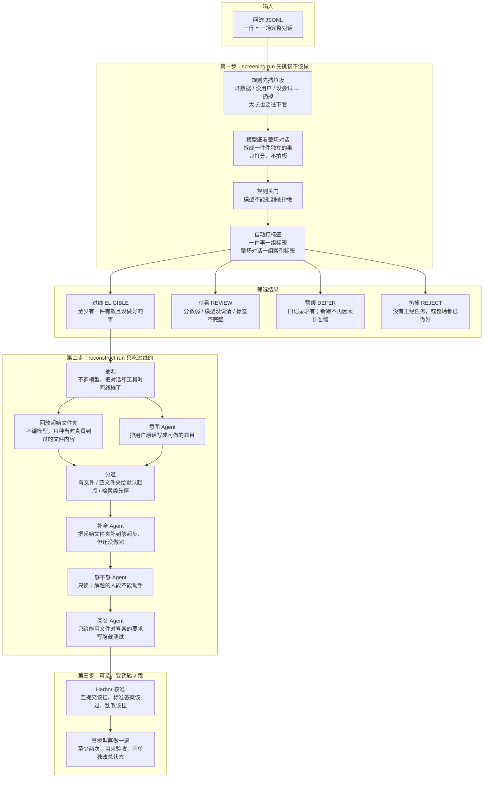
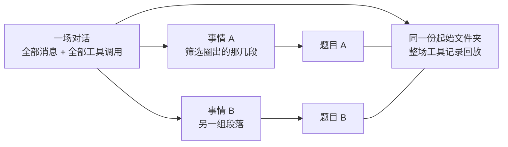
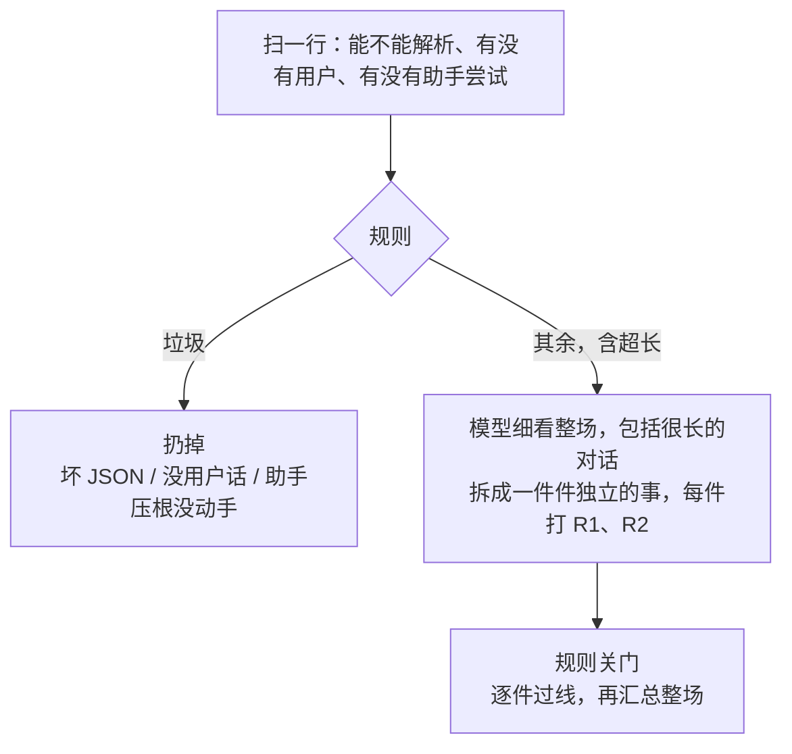
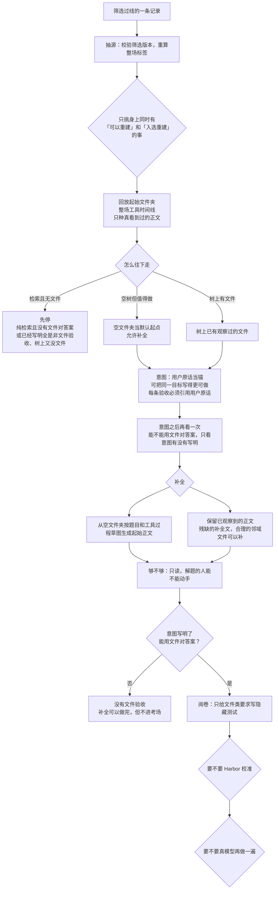

# 重建在干什么（对照当前代码）

状态：2026-09-21，以源码为准  
入口文档：先读本文，再按文末索引去看细则。  
筛选尺子冻结版本：`reconstruction-screening-v10`（2026-09-15 校准后不再改分数含义）

---

## 一句话

真实对话里，用户交代过一件没做好的事。我们要做出一套**新作业**：题目说清楚、起始文件夹够用但还没做完、必要时再出一套阅卷标准。原始对话只当素材，不当标准答案。

做成两样东西：

| 人话 | 代码里叫什么 | 从哪截 |
|------|--------------|--------|
| **题目** | `q` | 筛选圈出来的那一件事（一段对话） |
| **起始文件夹** | `E` / `bE` | **整场对话**里出现过的工具调用，不只是这一件事那段 |

一条 JSONL 行 = 一场对话。一场里可以有好几件互不相干的事：每件过线的事各自出一份题目，但起始文件夹共用整场的工具记录。

---

## 总图



官方命令只有两条：

```text
screening run     挑该不该重建
reconstruct run   真去做题目和起始文件夹
```

`reconstruct source` 只抽源、不调模型。旧的轨迹编译入口已经删了。

---

## 题目和起始文件夹为什么拆开



- **写题目的人**只看这件事的用户原话。别的事里用户说的目标，不能并进来。
- **回放文件夹的人**看整场对话的读文件、写文件、跑命令。文件经常在另一段里被读到，环境是整场共用的。
- 一场里多于一件事时，整场会打上「多任务」标签：写题目时禁止把 B 的目标写进 A。

每条重建还会落一份对照文件 `tasks/<任务编号>/task_environment_pair.json`：左边是通过意图检查的题目，右边是回放证据、还缺的文件、验证状态。

---

## 第一步：筛选

筛选看的是**整场对话**，不是最后一个用户问题。抓取状态写成 completed，只表示这段对话录完了，不表示事情做成了。

只问两句：

1. 用户是不是交代了一件**正经事**？（尺子 R1）
2. 这件事**做成了没有，或做得好不好**？（尺子 R2）

有没有读文件、写文件，只用来看环境和过程。该用的工具没用，本身就是没做好，**同样要过线**。不要因为轨迹里没改文件就把正经事丢掉。

### 先挡垃圾，再让模型打分



规则层**不能单独说「过线」**。模型只打分和分类，最终谁进重建由规则关门。规则已经扔掉的，模型翻不回来。轨迹太长不再暂缓，一样交给模型挑没做好、没做完的事。

默认用 DeepSeek 做筛选。对话特别长时只标记「超预算」，不机械砍掉中间证据。证据大到当前模型窗口塞不下时，这一条会待看，等有分块方案或更大窗口再评，不是因为「太贵」直接丢掉。

### 尺子：两道分，每道 0 到 3

权威实现：`src/traceforge/screening/rubric.py`。模型给每件事打两道分，规则再关门。

| 人话 | 代码键 | 0 分 | 1 分 | 2 分 | 3 分 | 过线 |
|------|--------|------|------|------|------|------|
| 这是不是一件正经事 | R1 任务可识别 | 没有任务 | 只能猜用户要啥 | 目标基本明确 | 目标、交付物、关键约束都有用户原话 | **至少 2 分** |
| 做成了没有 | R2 失败或未完成 | 已经做好，过程正常结束 | 有点不对劲，但很弱 | 没做完或做得不好 | 失败边界能指出来 | **至少 2 分** |

R2 打到 2 分或以上，包括这些情况：

- 环境不行：缺文件、缺依赖、没权限
- 模型没做好：答错、卡住、没交东西、用户当场纠正
- **该用的工具没用**
- 对话被截断、一直挂起、轨迹不合理

有回复但对不准用户要的事，不要标成「成功」。

一件事要过线，还得同时满足：

- 是可动手的正经事，不是闲聊
- 结果是失败或没做完（不是成功、也不是说不清）
- 模型认为需要重建
- 标签字段齐全
- 后面没有「同一目标已经做成」把它顶掉

整场怎么汇总：

| 情况 | 整场结果 |
|------|----------|
| **任意一件**过线 | 整场过线，记下这几件事、这几段对话 |
| 全部成功，或全部被终端拒绝 | 扔掉 |
| 规则已经扔掉 | 仍以规则为准 |
| 模型没跑成、一件事都拆不出来、旧记录缺字段 | 待看，不进自动重建 |

### 辅助标签：这件事大概属于哪类

这只是路线提示，**不挡「有没有任务」**。

| 人话 | 代码值 | 筛选之后 |
|------|--------|----------|
| 终端 / 改工作区 | `terminal`（旧记录里的 `code_file` 当这个） | 过线后走文件任务线 |
| 主要在网上搜 | `retrieval` | **待看**，当前主链不接检索后端 |
| 闲聊，或正经事但对不上上面两类 | `other` | 过线后走普通任务线 |

有工作区工具时，整场优先走文件任务线。检索不再因为「领域」被暂缓，但当前实现会待看，不进自动重建。

### 几件事之间的关系

只认三种：接着做、纠错、依赖。必须有两端证据、按时间向前，不能自己指自己。每一段对话只能属于一件事，所有段落都必须有归属。

同一目标的追问、纠错，应尽量并成一件事。如果被拆开了，后面有证据做成了，前面那次失败会被标成「已被后来的成功顶掉」，不再当重建样本。**依赖**不会把前面那件事取消。

旧的 v9 筛选记录缺关键字段时，重建抽源会拒绝，必须重跑筛选。

---

## 标签：两套，别混

模型**不能自己写标签**。全部由规则从「做成没做成 / 过没过线 / 几件事什么关系」自动派生。权威实现：`src/traceforge/screening/task_labels.py`。

### 第一套：一件事身上的标签（用来挑谁进重建）

下游要挑重建对象，必须同时满足：这件事变体字段说「可以重建」，**并且**身上有「入选重建」标签。少一个都不行。

| 标签（人话） | 代码名 | 什么时候出现 | 后面怎么用 |
|--------------|--------|--------------|------------|
| 正经事 / 闲聊 | `actionable` / `non_actionable` | 是不是可动手的任务 | 闲聊不重建 |
| 失败 / 没做完 / 成功 / 说不清 | `failure` `incomplete` `success` `uncertain` | 对应结果 | 看形态 |
| 需要重建 / 不必重建 | `needs_reconstruction` / `no_reconstruction_needed` | 模型给的是/否 | 和结果交叉核对 |
| **入选重建 + 尺子通过** | `selected_for_reconstruction` + `rubric_pass` | 这件事过线 | **唯一入选标记** |
| 尺子待看 / 尺子拒绝 | `rubric_review` / `rubric_reject` | 没过线 | 不自动重建 |
| 已被后来的成功顶掉 | `superseded_by_later_success` | 同一目标后面做成了 | 不当样本 |

### 第二套：整场对话的索引标签

只描述这场对话长什么样。**不**决定过不过线，**不**挑选重建哪一件，**不**决定后面走文件线还是检索线。

| 标签（人话） | 代码名 | 谁看 |
|--------------|--------|------|
| 整场过线 / 待看 / 暂缓 / 扔掉 | `screening_eligible` 等 | 检索、对照 |
| 这场里有可重建候选 | `contains_reconstruction_candidate` | 找「有货」的对话 |
| 混有没做完 / 已成功 / 闲聊 | `contains_unfinished_task` 等 | 写题目时别把闲聊或已成功问当成当前题 |
| 一场里多于一件事 | `multiple_tasks` | 写题目时禁止合并 |
| 有接着做 / 纠错 / 依赖 | `has_continuation` 等 | 只在这件事自己的段落里收澄清 |

写题目时会把「这件事的标签」和「整场标签」一并塞给模型当背景。后面分道只把它们记进审计，**不用整场标签改执行路线**。

分数含义、冻结期内不改什么，见 [筛选尺子细则](reconstruction-screening-rubric.md)。

---

## 第二步：重建

编排在 `eligible_reconstruction.py`。每个角色是一次独立的 Hermes：自己的身份、自己的工具、自己的轮次。编排器只排顺序，**任一步说「待看」就停**。



### 回放：不调模型

按路径取**第一次看到、且后面没被乱写污染**的正文。只种真观察过的内容：目录列表、光有文件名，都不算种进去了。后面出现看不懂的写操作，会挡住这条路径，之后的内容只留作私证，不进公开文件夹。

### 三条道

| 人话 | 代码里的起点 | 补全怎么做 | 阅卷 |
|------|--------------|------------|------|
| 树上已经有观察过的文件 | `REPLAYED` | 保留观察正文；残缺的补全文；合理邻域可以补 | 只有意图写明了「用文件对答案」才跑 |
| 树是空的，但不是「纯检索」 | `DEFAULT_EMPTY` | 按题目和工具过程，生成**任务开始前**该有的正文 | 同上 |
| 空树 + 纯检索；或写明全是非文件验收、树上又没文件 | `NONE` | 不跑 | 不跑 |

「树太瘦」不再单独卡死。全是非文件验收时，补全和「够不够」仍可跑完，但在阅卷前停住，总状态保持待看。

### 意图：用户原话是锚，不是逐字誊抄

允许把同一目标写得更可做（例如把回放里能对上的文件写进验收），禁止换成旁边另一道无关题，禁止把助手建议或工具动作写成用户要求。

当前还卡着这些：

- 每条验收必须引用用户原话编号
- 每条验收恰好标明一种对答案方式：能用文件对，或不能
- 能用文件对的路径，只能来自回放里**真看到过正文**的路径；光有文件名不算
- 树是空的，不得凭空发明一个项目
- 树非空、且用户原话能落到这些文件上（点名了路径、说了读代码、或筛选标成终端任务），就必须至少有一条就绪的文件验收；否则待看
- 纯只读评审、用户没要求改代码，不强迫写成文件验收

### 补全 / 够不够 / 阅卷

| 角色 | 吃什么 | 吐什么 | 不准干什么 |
|------|--------|--------|------------|
| 补全 | 题目、回放树或空目录、缺口卡片、工具时间线 | 任务开始时的真实文件正文；三行占位不能过 | 不得把题做完、不得写隐藏测试、不得把网上搜来的源码种进用户路径 |
| 够不够 | 候选文件夹 + 文件验收列出的路径 | 解题的人能不能**动手**（缺的能力本身就该还缺着） | 只读，不改树 |
| 阅卷 | 够用的文件夹 + 文件验收 | 隐藏测试：缺能力的测试在当前起始文件夹上必须挂，保护性测试必须过 | 不为「不能用文件对答案」的要求编假文件测试 |

### 考场（可选）

加 `--sandbox` 才把文件和测试打到容器里。默认是本机 Hermes 代理。加 `--execute-red` 才做空提交 / 标准答案 / 乱改 三连校准。加 `--execute-rollout` 才让真模型再做一遍，用来验收，**不会**单独把总状态改成完成。

Harbor 自己的冒烟只证明考场底座能通，和「从失败对话编出考卷」不是同一条链。

---

## 谁在跑、用哪套提示词

每个角色新建一次 Hermes，提示词和工具分开。

| 人话角色 | 当前提示词版本 | 能用的工具 | 默认模型 |
|----------|----------------|------------|----------|
| 筛选 | `reconstruction-screening-triage-v10` | 无，一次 JSON | 筛选通道 → DeepSeek |
| 意图 | `intent-recovery-agent-v10-anchor-deepen` | 只读对话和用户原文 | 重建通道 |
| 补全 | `workspace-completion-agent-v6-pre-task-state` | 读写文件夹、看证据、可搜索 | 重建通道 |
| 够不够 | `workspace-sufficiency-agent-v5-pre-task-solvability` | 列目录、读文件 | 重建通道 |
| 阅卷 | `terminal-universe-verifier-adaptation-v3` | 写测试、跑测试 | 阅卷通道 |
| 再做一遍 | Harbor Hermes | 解题工具 | 解题通道 → Claude |

通道怎么配，见 [跑任务配置](terminal-run-config.md)、[模型通道](model-gateway-config.md)。

---

## 产物怎么读

筛选：

```text
artifacts/screening/
  selection_manifest.json          过线清单
  private/records.jsonl            每一行的决定、拆出来的事、整场标签
```

重建（每次跑）：

```text
reconstruction_manifest.json       总状态、停在哪、各阶段摘要
intent/intent.json                 题目
tasks/<任务编号>/
  回放产物
  completion/completion.json       补全
  sufficiency/                     够不够
  verification/                    只有文件验收才有
  task_environment_pair.json       题目和起始文件夹对照
```

先看总清单里「停在哪」和「走了哪条道」，再看意图里怎么对答案，再看补全 / 够不够 / 阅卷。

---

## 命令

```text
# 筛选：只把过线的送给重建
PYTHONPATH=src python -m traceforge screening run \
  --input return_data/four_batch/by-rubric/R01.jsonl \
  --output artifacts/screening \
  --channel deepseek \
  --concurrency 8

# 重建：默认不做 Harbor
PYTHONPATH=src python -m traceforge reconstruct run \
  --input return_data/four_batch/by-rubric/R01.jsonl \
  --records artifacts/screening/private/records.jsonl \
  --line-number <行号> \
  --output artifacts/eligible-live/<run-id> \
  --config config.yaml \
  --channel claude \
  --hermes-home "$HERMES_HOME"
```

再加 `--sandbox --execute-red` 才校准；再加 `--execute-rollout` 才让真模型再做一遍。`requery` 是另开的出新题入口，不在这条主链里。

---

## 现在必须知道的边界

- 筛选尺子已冻结：没做新校准前，不改 R1/R2 含义、过线门槛、或「任意一件过线整场过线」。
- 主链优先终端文件任务。检索在筛选就会待看；全是非文件验收到不了 Harbor。
- 意图深化仍必须引用用户原话；空树不得发明项目。
- 补全必须是真正文，三行占位不能过。
- 真实终端样本还没有走完「校准通过 + 真模型再做一遍」。Harbor 冒烟只证明考场，不证明重建。
- 命令退出码 0、本地测试全绿、审计脚本说 pipeline_ok，都不能单独当成端到端成功。

---

## 文档怎么读

| 先看谁 | 讲什么 | 什么时候打开 |
|--------|--------|--------------|
| **本文** | 人话总图、单位、筛选尺子和标签、重建每一步 | 第一次了解，或对外讲策略 |
| [筛选尺子细则](reconstruction-screening-rubric.md) | 冻结分数、校准数字、明确不改项 | 要改筛选或核对一条记录为什么没过线 |
| [筛选实施计划](reconstruction-screening-plan.md) | 筛选分过几期、入口怎么接 | 查历史分期，现行尺子以细则为准 |
| [活跑阅读地图](rebuild-live-map.md) | 改代码按什么顺序读、活跑卡在哪、对照哪份产物 | 动手改重建主链 |
| [跑任务配置](terminal-run-config.md) | 模型、超时、沙盒怎么配 | 真跑一条之前 |
| [模型通道](model-gateway-config.md) | 筛选 / 重建 / 阅卷各走哪路模型 | 通道对不上或要换模型 |
| [Harbor 边界](harbor-ags-boundary-adapter.md) | 考卷和考场各自看见什么 | 校准对不上、或怀疑泄漏 |
| [失败分析复用](failure-analysis-reuse.md) | 失败分析模块和主链的关系 | 不要把旁路分析当成重建入口 |
| [开发规范](../AGENTS.md) | 唯一开发规矩 | 改代码、评审 |

仓库首页 [README](../README.md) 只保留怎么启动；策略以本文为准，开发规矩只引用 AGENTS.md。
