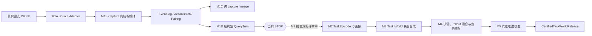

# TraceForge 开发会话交接

版本：M1D 检查点

日期：2026-09-03

状态：M1A/M1B **v4**、M1C v2（重绑定 v4 run）与 M1D v1 正式通过；已验收代码停止在 M1D；M1 主线在 R01 上全部闭合；M2 前置 `UserTextProjection` 规格已评审修订到 v0.2，待 v4 run 探针后冻结为 v0.3

## 1. 本文用途

本文是新开发会话的当前检查点和权威索引，不替代总体计划或模块规格。新会话按以下顺序阅读：

1. [`../AGENTS.md`](../AGENTS.md)：唯一开发规范；
2. 本文：当前事实、停止线和下一步；
3. [`background-and-goals.md`](background-and-goals.md)：背景、目标和主张边界；
4. [`overall-plan.md`](overall-plan.md)：完整架构、模块和阶段门；
5. [`r01-processing-spec.md`](r01-processing-spec.md)：M1 精确输入、算法、契约与验收；
6. [`r01-m1b-v4-validation.md`](r01-m1b-v4-validation.md)：M1A/M1B **v4** 正式验收证据（当前有效）；[`r01-m1-v3-validation.md`](r01-m1-v3-validation.md)：v3 历史验收；
7. [`m1c-processing-spec.md`](m1c-processing-spec.md) 与 [`r01-m1c-validation.md`](r01-m1c-validation.md)（§0′ 为当前有效结论）：M1C 契约与正式验收证据；
   [`m1ab-v3-known-items.md`](m1ab-v3-known-items.md)（R1–R9；R4/R5/R7/R8 随 v4 关闭，R9 随 M1D 提交关闭）与 [`m1c-known-items.md`](m1c-known-items.md)（K1–K3）：已知项登记；K1/K2 已由 M1C v2 从根因关闭，**上游不透明摘要不入任何关系证据**是 v2 起的通用原则；
8. [`m1d-processing-spec.md`](m1d-processing-spec.md)（v0.3，实现同步稿）与 [`r01-m1d-validation.md`](r01-m1d-validation.md)：M1D 契约与正式验收证据；[`m1d-review-20260902.md`](m1d-review-20260902.md)：已处置的评审意见（存档）；
9. [`m2-source-projection-spec.md`](m2-source-projection-spec.md)（v0.2，待探针后冻结）与 [`m2-source-projection-review-20260903.md`](m2-source-projection-review-20260903.md)：M2 前置 `UserTextProjection` 规格与评审意见（下一步）；
10. [`reference-repositories.md`](reference-repositories.md) 与 [`implementation-sources.md`](implementation-sources.md)：参考逻辑和迁移边界。

如果本文与模块规格冲突，以 `r01-processing-spec.md`（M1A/B）、`m1c-processing-spec.md`（M1C）和 `m1d-processing-spec.md`（M1D）的契约为准；如果与开发纪律冲突，以 `AGENTS.md` 为准。

## 2. 背景与最终目标

真实企业 Agent 回流包含用户请求、模型回复、工具调用、observation、上下文包装和部分运行元信息，但通常没有标准答案、完整用户环境、可靠成功标签或清晰责任归因。TraceForge 不把回流直接改写成训练样本，也不声称恢复真实用户环境。

项目最终目标是：

> 从真实回流中提取可审计的任务与环境约束，将其编译成 Task 与 World 严格绑定、可执行、可验证、可调难度，并位于目标模型能力边界附近的训练和评测单元。

核心立场：回流提供生成约束，不提供 Ground Truth；Truth 必须来自可控 World，Reference 只证明至少一条可达路径，Verifier 独立检查结果；强模型 rollout 用于验证、诊断和难度校准，不能通过投票生成 GT。

## 3. 总体链路与当前停点



当前只完成实线部分：M1A/B v4 → M1C v2、M1D v1 均在 R01 上正式验收，三者的 run 以内容寻址身份链式绑定（`84d826b3…` ← `6be45e01…` → `9ff708d9…`）。M1D 与 M1C 并列消费 M1B run，互不依赖（M1D 默认不启用 M1C 做跨 capture 线程图，规格 §11 D-c）。仓库中没有 M2、World、认证、难度或 Harbor 的空壳实现。

## 4. 仓库与冻结输入

```text
本地仓库：/Users/wujian1/Downloads/traceforge（Mac）
        /mnt/afs_toolcall/wujian1/Projects/workspace/traceforge（验收机，AFS 共享盘，分支 m1c-lineage）
远程：git@gitlab.sh.sensetime.com:wujian1/traceforge.git
分支：main
R01（Mac）：/Users/wujian1/Downloads/seed2traj/return_data/four_batch/by-rubric/R01.jsonl
R01（验收机全量真源）：/mnt/afs_toolcall/juxiaolong1/Projects/DataFilter_v2/gpt56sol/domain/by-rubric/R01.jsonl
  （验收机仓内 return_data/.../R01.jsonl 为 368 行截断副本，禁止用作输入）
dataset_id：r01-four-batch-202607-v1
source_schema：traceforge.restored-long-capture.v1
字节数：560,481,884
物理行数：1,683
SHA-256：3832d8aa4ecd577636ce67b56d8798d9fb6311662a7bbce65814e5e8d260d4d8
```

必须保持以下区别：

- 一条 JSONL 是 capture 快照，不是 Session、request 或 task；
- `thread_id/account_id` 只形成 956 个候选比较组，不能直接充当 lineage；
- R01 是来源 cohort 和检索 rubric，不是业务 Domain；
- 当前统计是 capture 结构与损耗画像，不是 Episode、任务或真实环境分布。

## 5. 当前代码冻结点与契约版本

M1A/M1B **v4** 正式全量运行绑定的代码冻结点（`trajectory/` 代码 = 提交 `8f6f65c`；run 在其后代 `943ba92` 上构建，二者 `trajectory/` 无差异）：

```text
Git commit：943ba922270a368440ad5a81028da4beda58508b
Git tree：aa083fbe9d46fba3b786e2d4d375967034b78576
dirty：false
TraceForge：0.3.0
compiler contract：trajectory-compiler-m1ab-v4
ToolPairing schema：traceforge.tool-pairing.v3
```

（v3 冻结点 `c3c0a8f` / contract `trajectory-compiler-m1ab-v3` 为历史结论，v4 validator 对 v3 run 按设计 fail-closed。）

M1C v2 重绑定 v4 run 的正式运行绑定同一提交 `943ba92`（`lineage/` 相对 `fcff8cf` 仅 `reader.py` 文档字符串 2 行，无运行时变化）：

```text
lineage contract：lineage-compiler-m1c-v2
```

M1D v1 正式全量运行绑定的代码冻结点：

```text
Git commit：1c588bed6cfbb696611823ce427fdaa8fd06e249
Git tree：2bc0f4bc4da4eadeb3fbcfa3a187618d3e6669f8
dirty：false
query-turn contract：query-turn-compiler-m1d-v1
```

交接文档自身会形成后续纯文档提交；新会话必须用 `git log` 确认 HEAD 是上述冻结点的后代，并确认 `1c588be` 之后没有未重新验收的 `src/traceforge/trajectory/`、`src/traceforge/lineage/`、`src/traceforge/query_turns/`、`pyproject.toml` 或 `uv.lock` 变化。

## 6. M1 已实现能力

M1A/B 位于 `src/traceforge/trajectory/`（字段与算法只在 `r01-processing-spec.md` 定义）；M1C 位于 `src/traceforge/lineage/`（`m1c-processing-spec.md`）；M1D 位于 `src/traceforge/query_turns/`（`m1d-processing-spec.md`）。M1A/B 能力边界如下：

- 单一显式 restored-long source adapter，不对任意 JSON 猜格式；
- 两遍流式扫描、stat/digest/字节数/行数闭合和逐行来源账本；
- 内容寻址 run、稳定 ID、canonical JSON/JSONL、原子发布和 Git provenance receipt；
- `NormalizedCapture`、`RequestBoundary` 与 occurrence-preserving EventLog；
- assistant decision、tool call、tool result 拆分，ActionBatch 语义固定为 `UNKNOWN`；
- pairing 只按显式 `tool_call_id`，异常或重复组不生成伪精确 matched 边；
- 五类 event payload 由唯一 typed reader 解释；
- 多轴质量状态，不用一个含糊的 `valid`；
- 任意深度 reasoning 原文递归摘要，Data URL 正文不进入派生产物；
- private 事件表与 public 聚合报告物理分离；
- 独立 validator 重算 boundary、ActionBatch、pairing、quality、report、typed payload 与隐私不变量。

M1D（`query-turn-compiler-m1d-v1`）在已发布 M1B run 之上：先跑 M1B 权威 validator 再消费；以 `sequence_number` 升序的**可观测事件流**为工作对象，boundary 只作证据锚点；键于 assistant 事件建 `AgentStep`，工具观测**按 `ToolPairingRecordV3` 配对归属**而非位置；可定位 USER 段起 `OBSERVED_ROOTED` 回合，窗口以 assistant 起头则起 `PREFIX_ROOTED` 回合（根在不可定位前缀，显式暴露）；末步有 ActionBatch 即 `INCOMPLETE`、否则按 typed reader 冻结标量判 `TEXT/EMPTY_OUTCOME`；capture 内相邻回合连 `STRUCTURAL_NEXT_TURN` 边；每 capture 一条记账（前缀/观测逐 kind 计数、孤儿观测、compaction）。零模型调用、零语义关系。validator 为两层信任边界：篡改检测（同一纯 fold 重建 + 六表双向 bijection）与不经 fold 的正交不变量（观测事件分区守恒、记账对账、末 assistant 与 M1B `terminal_status` 交叉核对、报告由表重算）。

## 7. 本轮审计闭环

v1、v2 验收报告的正式结论均已撤销，只保留历史正常路径事实。v3 闭合三类 P1：

1. typed payload、terminal quality/report 与 tool arguments pointer 可同步重签假绿；
2. URL、路径、query 或凭据形式的 dataset ID 可进入公共报告；
3. `NAME_MISMATCH`、`RESULT_BEFORE_CALL`、`INVALID_CALL_ARGUMENTS` 等异常 1:1 组仍生成 `matched_*`。

正式验收前的独立红队又发现同属第 1 类的 Data URL envelope 变体：把内外审计长度同步伪造为 0 可把非空终态伪报为空。代码冻结提交 `c3c0a8f` 增加两个独立不变量：合法 Data URL envelope 必须为正长度；terminal 空非空由 value 形态重算，而不是由审计长度决定。纯 Data URL、混合文本、零长度和正长度绕过均已 fail-closed。

对抗审计另发现两项**带来源接受、暂不修改冻结代码**的已知项，登记在 [`m1ab-v3-known-items.md`](m1ab-v3-known-items.md)：R1（隐私脱敏续行判定只认 CR/LF，裸空格/制表符致 base64 尾段 fail-open；R01 未触发、产物 0 base64）与 R4（截断轴把源自报 `input_truncated=False` 渲染成 `OBSERVED_NOT_TRUNCATED`，属规格 §5.5/§7 已批准的设计张力）。两项均未使任一验收门变红；任何收紧都必须走单独 reopen 与重新验收。2026-09-01 会话已把 gate 4/6 及 gate 1/5/7 现场升级为 live 亲证，证据见 [`r01-m1-v3-validation.md`](r01-m1-v3-validation.md) §8。

## 8. 正式验收证据

### 8.0 M1A/M1B v4（2026-09-03，当前有效）

```text
run ID：6be45e01cb97b14ce8cfeeed4b0860097a7006619a83e9a32f1284ee5775c8ed
artifact manifest SHA-256：179b82efca85fc6132bfa806d45b081729b0d5627878b0d517e978070fe99eb1
运行 A：回执 82.359419 秒，RSS 37,945,344 bytes
运行 B：回执 83.436668 秒，RSS 37,851,136 bytes
validator A/B：ok=true；10 files；1,683 lines；175,858 events
递归 diff：排除 run_receipt.json 后无差异；与审核方会话单跑产物逐字节一致
反向核对：v4 validator 对 v3 run 519a86d3… 报 SCHEMA/CONTRACT 版本不匹配（预期）
v3→v4 字节差异逐文件归因于 schema 升级、枚举/字段改名，无业务逻辑变化
```

```text
artifacts/r01/6be45e01cb97b14ce8cfeeed4b0860097a7006619a83e9a32f1284ee5775c8ed/
artifacts/r01/acceptance/6be45e01cb97b14ce8cfeeed4b0860097a7006619a83e9a32f1284ee5775c8ed/
```

长期可提交摘要见 `r01-m1b-v4-validation.md`。v3 run `519a86d3…`（manifest `9dcdb083…`）与其证据保留为历史（`r01-m1-v3-validation.md`）。

### 8.1 M1C v2 重绑定 v4 run（2026-09-03，当前有效）

```text
lineage run ID：9ff708d98773a175f9552b09ea1171f16a6ba3bbe4a4ffbcc4fdec2612acb17b
绑定 M1B run：6be45e01…（manifest SHA-256 179b82ef…）
lineage artifact manifest SHA-256：83934c6c4f9366dd7046e136161f78367a082f5748eb404532fa4816cef9eaeb
运行 A：112.479697 秒，RSS 244,387,840 bytes
运行 B：114.908946 秒，RSS 244,424,704 bytes
validator A/B：ok=true；5 files；SHARED 1,671 / SUCCESSOR 4,994 / DUPLICATE 0，与 §4.4 逐项一致
递归 diff：排除 run_receipt.json 后无差异
相对 978c0347…（绑定 v3 run）：全部文件字节不同（ID 以 m1b_run_id 命名空间化），剥离 ID 后节点/边集合完全相同
```

```text
artifacts/r01/lineage/9ff708d98773a175f9552b09ea1171f16a6ba3bbe4a4ffbcc4fdec2612acb17b/
artifacts/r01/acceptance_m1c/9ff708d98773a175f9552b09ea1171f16a6ba3bbe4a4ffbcc4fdec2612acb17b/
```

长期可提交摘要见 `r01-m1c-validation.md` §0′；旧 run `978c0347…` 保留为历史。§7 登记的两项环境已知项仍有效：慢盘上 `git status` 超过 provenance 的 5 秒超时会使就地 run 被 validator 拒绝（正式 run 一律在本地盘干净克隆上执行）；验收机仓内 `return_data/.../R01.jsonl` 为不完整副本，全量真源路径见 §4。

### 8.2 M1D v1（2026-09-03，当前有效）

```text
query-turn run ID：84d826b3d7abddffb5f8fde28d7e5592590720bd6909c24a8b17b7f0c70b66ea
绑定 M1B run：6be45e01…（manifest SHA-256 179b82ef…）
M1D artifact manifest SHA-256：56a3befe44bec087a52aaa680f592eb71e196c7d7bd946e47c172540cb190bfe
运行 A：回执 211.258606 秒，RSS 244,621,312 bytes
运行 B：回执 202.558055 秒，RSS 244,928,512 bytes
validator A/B（双参）：ok=true；8 files；13 项计数与审核向量及 v3 run 上的 M1D 计数逐项一致
递归 diff：排除 run_receipt.json 后无差异；五张业务表与审核方会话产物逐字节相同
反向核对：以 v3 M1B run 作 oracle → M1B_INPUT_INVALID（fail-closed）
测试：273 passed（M1D 55）；Ruff lint/format：通过
```

```text
artifacts/r01/query_turns/84d826b3d7abddffb5f8fde28d7e5592590720bd6909c24a8b17b7f0c70b66ea/
artifacts/r01/acceptance_m1d/84d826b3d7abddffb5f8fde28d7e5592590720bd6909c24a8b17b7f0c70b66ea/
```

长期可提交摘要见 `r01-m1d-validation.md`。真实 run 和证据均被 Git 忽略。

## 9. 当前关键数据事实

| 观察 | 结果 | 含义 |
| --- | ---: | --- |
| capture | 1,683 | 全部有 M1 结构终态 |
| RequestBoundary occurrence | 9,561 | 跨 capture 存在明显重叠 |
| 唯一 source request | 6,301 | boundary 不能直接当独立 request 样本 |
| EventOccurrence | 175,858 | 事件类型与 scope 守恒 |
| 严格一对一 pairing | 49,800 | 其余组保留异常或未观测状态 |
| 含未观测 result 的 capture | 1,248 | `COMPLETE` 不等于工具或任务成功 |
| comparison partition | 956 | 只能作为阻塞式候选提示 |
| 保守结构候选 | 353 | 仍然不是 task，必须先做 lineage 与 QueryTurn |
| `SHARED_SOURCE_REQUEST` 边（M1C） | 1,671 | 全部为"共享前缀后分叉"的兄弟 capture，0 例跨候选组 |
| `EXPLICIT_REQUEST_SUCCESSOR` 边（M1C） | 4,994 | 请求级真森林：入度 ≤ 1、最大出度 13、无环 |
| `COMPLETE_DUPLICATE_CAPTURE` 边（M1C） | 0 | 契约保留，R01 无完整重复 capture |
| `QueryTurn`（M1D） | 2,610 = 1,683 `PREFIX_ROOTED` + 927 `OBSERVED_ROOTED` | 每 capture 恒一个根在前缀的首回合；仅 927 个回合有可定位用户根 |
| `AgentStep` / `UserBlock` / 结构边（M1D） | 14,375 / 927 / 927 | AgentStep 是唯一始终可定位的单元；边数 = 回合数 − capture 数 |
| `COMPLETE` / `INCOMPLETE` 回合（M1D） | 1,200 / 1,410 | R01 无 `EMPTY_OUTCOME`；INCOMPLETE 全部为末步工具调用步或 USER-only 回合 |
| 孤儿工具观测 / 含 compaction capture（M1D） | 324 / 119 | 孤儿=配对到前缀调用的观测结果，集中在少数 capture |

不要将 `processing_status=COMPLETE` 解读为任务完成，也不要把 353 个结构候选直接交给任务合成。M1C 的边是 Control 侧来源解析信息，不进入任何 Public 视图，也不用于硬去重。M1D 的回合是**结构**分组：`PREFIX_ROOTED` 回合的用户意图不在观测窗口内，`root_status` 必须随回合一起传给下游。

M1D 规格 §0 的结构探针与正式 run 共同给出对 M2 极关键的事实：14,407 个 USER 事件中 13,225 落在不可定位的 `PRE_FIRST_OBSERVED_TERMINAL` 前缀；100% capture 存在不可定位前缀，80% 的 capture 观测窗口内没有可定位 USER，只有 927 个回合有可定位用户根。M2 前置的 `UserTextProjection` 若不显式允许以 `locality=PREFIX_UNLOCALIZED` 标记把前缀 USER 事件作为任务意图证据引用，`ObservedTaskDistribution` 的分母将只剩约 342 个 capture。

## 10. 当前硬停止线

未经下一阶段规格审核，不得实现或宣称存在：

- Grade-B `NORMALIZED_VISIBLE_PREFIX_OF`、已删除的 `IDENTICAL_RAW_REQUEST_HASH` 或任何非 3 类 Grade-A 的 lineage 关系；
- 任何以上游不透明摘要（`raw_request_hash`、`target_hash`、`input_truncated` 等自报值）为依据的关系或 `OBSERVED_*` 状态；
- 以 M1C 边为依据的 capture 硬去重、合并或"选最长丢其余"；
- 任何语义关系（`CONTINUES/REFINES/…`）、跨 capture 线程合并、前缀内容的语义还原，或任何 TaskEpisode（M1D 只产 `STRUCTURAL_NEXT_TURN`）；
- ObservedTaskDistribution 或 EnvironmentExposureProfile；
- 业务 Domain、World、Truth、Reference、Verifier；
- 可解性、难度、模型边界或自动纠正；
- Harbor、AGS、Hermes 或 TokenHub runtime integration。

Harbor 是将来 `RunnableTaskWorldCandidateBundle` 的 rollout 执行层，不是 TraceForge core，也不是当前 M1 的前置依赖。Harbor 部分由项目负责人另行负责。

## 11. 下一模块：M2 前置 `UserTextProjection`（来源投影层）

M1C 的四门（候选组仅 `BLOCKING_HINT_ONLY`、Grade-A 组盲、validator 独立核验分区、`raw_request_hash` 格式契约）与 M1D 的五门（纯确定性零 LLM、只在观测窗口分类、结构信号不读正文、工具观测按配对归属、Public/Control 隔离）分别在 [`m1c-processing-spec.md`](m1c-processing-spec.md) §3、[`m1d-processing-spec.md`](m1d-processing-spec.md) §3 冻结并经各自验收报告验收，此处不再复述。

**M1B v4 reopen 已闭合（2026-09-03）。** 四项已知项归两个根因一次处理：(a) 上游自报值不得渲染成观测（R4，`SOURCE_REPORTS_*`）；(b) 契约不保留无生产者的状态、业务规则只有一个定义（R7 删 `PARTIAL`、R5 严格匹配谓词抽为共用纯函数、R8 改名 `visible_payload_envelope_utf8_byte_length`）。在验收机全量真源上两次重编译复现 run `6be45e01…`，见 §8.0；M1C v2 随之重绑定（§8.1）；M1D 在 v4 run 上的 13 项计数与 v3 run 完全一致，证实 v4 对 M1D 字节中性。

**M1D 评审整改已闭合（2026-09-03，规格 v0.3）。** [`m1d-review-20260902.md`](m1d-review-20260902.md) 的 D1–D5 与 §3 三项决定全部处置：validator 改为两层信任边界（篡改检测调用同一纯 fold；fold 缺陷由不经 fold 的正交不变量层检出，含 D1 分区守恒），删除 `processing_status` 透传与 `QUARANTINED` 死分支（D4/D5），`parallel_semantics` 无 batch 取 `null`（D2），accounting 字段以实现为准（D3），终态交叉核对对象改为末 assistant（D-f），配对重复不设 tripwire、空观测流以防御性测试固定（§3）。该评审文档保留为存档。

**来源投影规格评审已完成一轮（2026-09-03，规格 v0.2）。** [`m2-source-projection-review-20260903.md`](m2-source-projection-review-20260903.md) 对照 M1B v4 代码给出 P1–P8 修正与 D3/D5–D9 决定，已全部写入 [`m2-source-projection-spec.md`](m2-source-projection-spec.md) v0.2：删除无生产者的 `QUARANTINED`（M1B validator 已对每个事件跑过 typed reader；"非字符串 value"是合法隐私 envelope），改为 `content_form` 透传 + `NO_LEADING_TEXT`；冻结开头标签文法与 256 码点判定窗；`UNKNOWN_TAGGED` 恒不落盘标签名（内容安全）；M1D run 可选但"提供即必须全部可解析"；报告三个分母并与 M1D 的 342 个有 `UserBlock` 的 capture 构成跨模块不变量；validator 与 M1D 同构的两层信任边界；白名单准入三规则（`task`/`image`/`irc` 等通用名词不准入）；D3 缓做 `SourceAnnotationProjection`，理由收敛为"不破坏 M2 两次独立提取的独立性"。[`r01-processing-spec.md`](r01-processing-spec.md) §8.2/§8.3 已同步修订（M1D 只做结构；M2 前置硬门 = `UserTextProjection` 必做，`SourceAnnotationProjection` 在 M2 首次消费 `domain_meta` 前必做）。

**下一步（唯一）**：按规格 §8 在 v4 run `6be45e01…` 上执行只读结构探针（只输出标签名与整数；本会话已编写但因执行审批渠道不可用未能运行），据其结果依 §2.3 准入规则定白名单 A–D 成员、更新 §0 与 §6 验收向量，把规格冻结为 v0.3；之后才进入 `src/traceforge/source_projection/` 的测试先行实现与独立 validator，并在 `6be45e01…`（+ `84d826b3…` 作可选输入）上双跑验收。该规格直面 §9 末段的事实：前缀 USER 正文以显式 `locality=PREFIX_UNLOCALIZED` 进入任务意图证据，否则 M2 分母塌陷（只剩约 342 个 capture / 927 个有根回合）；M2 不得按绝对路径私下重新解析原始 JSONL。M2 的 LLM 输入单元 = M1D `QueryTurn`（带 `root_status`）+ M1B 事件冻结标量 + 该投影提供的带来源、带 `text_class` 的 USER 事件引用；规格冻结前不写代码。

## 12. 参考资源采用边界

| 资源 | 当前用途 | 禁止事项 |
| --- | --- | --- |
| 旧 `seed2traj/search_audit` | `PRINCIPLE_ONLY`：来源账本、canonical artifact、显式位置/tool ID、测试组织 | 不迁移 rubric、人工 review、badcase、LLM judge、搜索停止逻辑 |
| AgentRx | 后续选择性重写 typed 状态、invariant 与 failure lifecycle | 不复用其 R01 converter，不用动态 invariant 或 LLM Judge 生成 Truth |
| Agent-World、ASTRA | M3 的 world-first、工具/证据图和联合演化原则 | 不前移到 M1，不声称恢复用户原环境 |
| TRACE、EnvHarness | M4/M5 的 self-test、mutation 和难度校准原则 | 不在当前阶段调用模型或生成训练任务 |
| `轨迹诊断.pdf` | M2 之后的证据视图和失败归因参考 | 不把归因标签写回 M1 事实层 |
| 腾讯 AGS/Hermes/TokenHub 指南 | 后续 rollout 执行边界 | 不进入 core，不替代 Truth/Verifier |

AgentHER、CSO、GameCraft-Bench 在当前本地快照中没有可审计、可采用的完整依据，不作为现阶段实现来源。所有参考资源均在 `/Users/wujian1/Downloads/seed2traj/refer_repo` 只读使用，TraceForge 运行时不得依赖该路径。

## 13. 新会话开工检查表

先执行只读检查：

```bash
git status --short
git log --oneline -5
git diff 8f6f65c..HEAD -- src/traceforge/trajectory pyproject.toml uv.lock
git diff fcff8cf88e7edcd645484318fd8bd12de50b7af7..HEAD -- src/traceforge/lineage
git diff 1c588bed6cfbb696611823ce427fdaa8fd06e249..HEAD -- src/traceforge/query_turns
.venv/bin/pytest -p no:cacheprovider -q
.venv/bin/ruff check --no-cache .
.venv/bin/ruff format --no-cache --check .
uv lock --check --offline --no-cache
.venv/bin/python scripts/validate_m1_run.py \
  artifacts/r01/6be45e01cb97b14ce8cfeeed4b0860097a7006619a83e9a32f1284ee5775c8ed
.venv/bin/python scripts/validate_m1c_run.py \
  artifacts/r01/lineage/9ff708d98773a175f9552b09ea1171f16a6ba3bbe4a4ffbcc4fdec2612acb17b \
  artifacts/r01/6be45e01cb97b14ce8cfeeed4b0860097a7006619a83e9a32f1284ee5775c8ed
.venv/bin/python scripts/validate_m1d_run.py \
  artifacts/r01/query_turns/84d826b3d7abddffb5f8fde28d7e5592590720bd6909c24a8b17b7f0c70b66ea \
  artifacts/r01/6be45e01cb97b14ce8cfeeed4b0860097a7006619a83e9a32f1284ee5775c8ed
```

预期：`trajectory/` 相对 `8f6f65c`、`lineage/` 相对 `fcff8cf`（除 `reader.py` 文档字符串 2 行）、`query_turns/` 相对 `1c588be` 均无运行时代码变化；测试全部通过（M1D 检查点为 273 项）；M1 validator 返回 `ok=true`、10 files、1,683 lines、175,858 events；M1C validator 返回 `ok=true`、5 files、计数与 §8.1 一致；M1D validator 返回 `ok=true`、8 files、13 项计数与 §8.2 一致。在 AFS 慢盘上，三个 validator 各需 1–4 分钟（M1C/M1D 内含对 706 MB 上游 run 的权威重验），属先校验后消费的必要成本。

在 AFS 共享盘工作区**就地**构建的任何 run 会因 `git status` 超过 provenance 5 秒超时而被 validator 拒绝——正式 run 一律在本地盘干净克隆上执行（[`r01-m1c-validation.md`](r01-m1c-validation.md) §7）。

## 14. 明确禁止项

- 不在 compiler 或通用 validator 中硬编码 R01 路径、摘要、统计或样本内容；
- 不把 capture、boundary、thread 或保守候选直接当 task；
- 不声称恢复真实用户环境或无偏生产分布；
- 不使用 rollout 多数票生成 Ground Truth；
- 不让任何下游读取或依赖旧 `reasoning_content` 原文；
- 不让 Harbor/AGS 反向依赖或污染 core；
- 不提交真实回流、完整 artifacts、模型缓存、密钥或参考仓库；
- 不处理 `claw-eval`。
