# TraceForge 开发会话交接

版本：M1B v3 检查点

日期：2026-09-01

状态：M1A、M1B v3 正式通过；代码停止在 M1B；M1C 尚未启动

## 1. 本文用途

本文是新开发会话的当前检查点和权威索引，不替代总体计划或模块规格。新会话按以下顺序阅读：

1. [`../AGENTS.md`](../AGENTS.md)：唯一开发规范；
2. 本文：当前事实、停止线和下一步；
3. [`background-and-goals.md`](background-and-goals.md)：背景、目标和主张边界；
4. [`overall-plan.md`](overall-plan.md)：完整架构、模块和阶段门；
5. [`r01-processing-spec.md`](r01-processing-spec.md)：M1 精确输入、算法、契约与验收；
6. [`r01-m1-v3-validation.md`](r01-m1-v3-validation.md)：当前正式验收证据；
7. [`reference-repositories.md`](reference-repositories.md) 与 [`implementation-sources.md`](implementation-sources.md)：参考逻辑和迁移边界。

如果本文与模块规格冲突，以 `r01-processing-spec.md` 的 M1 契约为准；如果与开发纪律冲突，以 `AGENTS.md` 为准。

## 2. 背景与最终目标

真实企业 Agent 回流包含用户请求、模型回复、工具调用、observation、上下文包装和部分运行元信息，但通常没有标准答案、完整用户环境、可靠成功标签或清晰责任归因。TraceForge 不把回流直接改写成训练样本，也不声称恢复真实用户环境。

项目最终目标是：

> 从真实回流中提取可审计的任务与环境约束，将其编译成 Task 与 World 严格绑定、可执行、可验证、可调难度，并位于目标模型能力边界附近的训练和评测单元。

核心立场：回流提供生成约束，不提供 Ground Truth；Truth 必须来自可控 World，Reference 只证明至少一条可达路径，Verifier 独立检查结果；强模型 rollout 用于验证、诊断和难度校准，不能通过投票生成 GT。

## 3. 总体链路与当前停点

```mermaid
flowchart LR
    A[真实回流 JSONL] --> B[M1A Source Adapter]
    B --> C[M1B Capture 内结构编译]
    C --> C1[EventLog / ActionBatch / Pairing]
    C1 --> S{{当前 STOP}}
    S -. 未启动 .-> D[M1C 跨 capture lineage]
    D --> E[M1D QueryTurn]
    E --> F[M2 TaskEpisode 与画像]
    F --> G[M3 Task-World 联合合成]
    G --> H[M4 认证、rollout 闭合与定向修复]
    H --> I[M5 六维难度校准]
    I --> J[CertifiedTaskWorldRelease]
```



当前只完成实线部分。仓库中没有 M1C、M1D、M2、World、认证、难度或 Harbor 的空壳实现。

## 4. 仓库与冻结输入

```text
本地仓库：/Users/wujian1/Downloads/traceforge
远程：git@gitlab.sh.sensetime.com:wujian1/traceforge.git
分支：main
R01：/Users/wujian1/Downloads/seed2traj/return_data/four_batch/by-rubric/R01.jsonl
dataset_id：r01-four-batch-202607-v1
source_schema：traceforge.restored-long-capture.v1
字节数：560,481,884
物理行数：1,683
SHA-256：3832d8aa4ecd577636ce67b56d8798d9fb6311662a7bbce65814e5e8d260d4d8
```

必须保持以下区别：

- 一条 JSONL 是 capture 快照，不是 Session、request 或 task；
- `thread_id/account_id` 只形成 956 个候选比较组，不能直接充当 lineage；
- R01 是来源 cohort 和检索 rubric，不是业务 Domain；
- 当前统计是 capture 结构与损耗画像，不是 Episode、任务或真实环境分布。

## 5. 当前代码冻结点与契约版本

正式全量运行绑定的代码冻结点：

```text
Git commit：c3c0a8fb6ed9927d5bebba55c616e1ef524c653b
Git tree：5438c8d3e421007bcc400c30c47862945caaae55
dirty：false
TraceForge：0.3.0
compiler contract：trajectory-compiler-m1ab-v3
ToolPairing schema：traceforge.tool-pairing.v3
```

交接文档自身会形成后续纯文档提交；新会话必须用 `git log` 确认 HEAD 是上述代码冻结点的后代，并确认冻结点之后没有未重新验收的 `src/`、`tests/`、`pyproject.toml` 或 `uv.lock` 变化。

## 6. M1 已实现能力

当前实现位于 `src/traceforge/trajectory/`，具体字段和算法只在 `r01-processing-spec.md` 定义。能力边界如下：

- 单一显式 restored-long source adapter，不对任意 JSON 猜格式；
- 两遍流式扫描、stat/digest/字节数/行数闭合和逐行来源账本；
- 内容寻址 run、稳定 ID、canonical JSON/JSONL、原子发布和 Git provenance receipt；
- `NormalizedCapture`、`RequestBoundary` 与 occurrence-preserving EventLog；
- assistant decision、tool call、tool result 拆分，ActionBatch 语义固定为 `UNKNOWN`；
- pairing 只按显式 `tool_call_id`，异常或重复组不生成伪精确 matched 边；
- 五类 event payload 由唯一 typed reader 解释；
- 多轴质量状态，不用一个含糊的 `valid`；
- 任意深度 reasoning 原文递归摘要，Data URL 正文不进入派生产物；
- private 事件表与 public 聚合报告物理分离；
- 独立 validator 重算 boundary、ActionBatch、pairing、quality、report、typed payload 与隐私不变量。

## 7. 本轮审计闭环

v1、v2 验收报告的正式结论均已撤销，只保留历史正常路径事实。v3 闭合三类 P1：

1. typed payload、terminal quality/report 与 tool arguments pointer 可同步重签假绿；
2. URL、路径、query 或凭据形式的 dataset ID 可进入公共报告；
3. `NAME_MISMATCH`、`RESULT_BEFORE_CALL`、`INVALID_CALL_ARGUMENTS` 等异常 1:1 组仍生成 `matched_*`。

正式验收前的独立红队又发现同属第 1 类的 Data URL envelope 变体：把内外审计长度同步伪造为 0 可把非空终态伪报为空。代码冻结提交 `c3c0a8f` 增加两个独立不变量：合法 Data URL envelope 必须为正长度；terminal 空非空由 value 形态重算，而不是由审计长度决定。纯 Data URL、混合文本、零长度和正长度绕过均已 fail-closed。

## 8. 正式验收证据

```text
run ID：519a86d3f48add7c37262b05db792d790aa49fccf67b7b92bbea2784e8e06d1d
artifact manifest SHA-256：9dcdb083bd202157ab8c9e90b8c660a0e18130c62d65cafe743a7c27a5549876
运行 A：42.648523 秒，RSS 116,637,696 bytes
运行 B：42.540646 秒，RSS 114,098,176 bytes
validator A/B：ok=true；10 files；1,683 lines；175,858 events
递归 diff：排除 run_receipt.json 后无差异
测试：160 passed
Ruff lint/format、离线 lock、Git diff check：通过
```

本地正式 run：

```text
artifacts/r01/519a86d3f48add7c37262b05db792d790aa49fccf67b7b92bbea2784e8e06d1d/
```

两次 receipt、manifest、validator 输出、diff 结论和原始 RSS 日志保存在：

```text
artifacts/r01/acceptance/519a86d3f48add7c37262b05db792d790aa49fccf67b7b92bbea2784e8e06d1d/
```

真实 run 和证据均被 Git 忽略。长期可提交摘要见 `r01-m1-v3-validation.md`。

## 9. 当前关键数据事实

| 观察 | 结果 | 含义 |
| --- | ---: | --- |
| capture | 1,683 | 全部有 M1 结构终态 |
| RequestBoundary occurrence | 9,561 | 跨 capture 存在明显重叠 |
| 唯一 source request | 6,301 | boundary 不能直接当独立 request 样本 |
| EventOccurrence | 175,858 | 事件类型与 scope 守恒 |
| 严格一对一 pairing | 49,800 | 其余组保留异常或未观测状态 |
| 含未观测 result 的 capture | 1,248 | `COMPLETE` 不等于工具或任务成功 |
| comparison partition | 956 | 只能作为阻塞式候选提示 |
| 保守结构候选 | 353 | 仍然不是 task，必须先做 lineage 与 QueryTurn |

不要将 `processing_status=COMPLETE` 解读为任务完成，也不要把 353 个结构候选直接交给任务合成。

## 10. 当前硬停止线

未经下一阶段规格审核，不得实现或宣称存在：

- 跨 capture Request/Capture Graph；
- QueryTurn 或 TaskEpisode；
- ObservedTaskDistribution 或 EnvironmentExposureProfile；
- 业务 Domain、World、Truth、Reference、Verifier；
- 可解性、难度、模型边界或自动纠正；
- Harbor、AGS、Hermes 或 TokenHub runtime integration。

Harbor 是将来 `RunnableTaskWorldCandidateBundle` 的 rollout 执行层，不是 TraceForge core，也不是当前 M1 的前置依赖。Harbor 部分由项目负责人另行负责。

## 11. 下一模块：只规划 M1C

下一会话不能直接写图代码。第一项工作是先形成并审核 M1C 的详细规格：输入、输出、关系等级、稳定 ID、冲突处理、证据等级、validator 重算规则和全量验收基线。

M1C 启动前四个硬门：

1. `candidate_group_id` 只能标记为 `BLOCKING_HINT_ONLY`，不能直接成为 lineage 证据；
2. Grade-A 显式关系不得受候选组边界限制；
3. M1C validator 必须独立重算候选组公式；
4. `raw_request_hash` 未满足届时冻结的格式契约时只能是 `UNKNOWN`，不得作为关系证据。

Grade-A 候选关系来自共享 source request、显式 request successor、满足冻结格式的 raw request hash 或完整重复 capture。`NORMALIZED_VISIBLE_PREFIX_OF` 只能是 Grade B 投影关系，不能单独用于因果 lineage、硬去重或主分布。

M1C 完成并单独验收后才讨论 M1D。进入 M2 前还必须冻结最小、带来源的 `SourceAnnotationProjection` 或只读 `SourceResolver`；M2 不得按绝对路径私下重新解析原始 JSONL。

## 12. 参考资源采用边界

| 资源 | 当前用途 | 禁止事项 |
| --- | --- | --- |
| 旧 `seed2traj/search_audit` | `PRINCIPLE_ONLY`：来源账本、canonical artifact、显式位置/tool ID、测试组织 | 不迁移 rubric、人工 review、badcase、LLM judge、搜索停止逻辑 |
| AgentRx | 后续选择性重写 typed 状态、invariant 与 failure lifecycle | 不复用其 R01 converter，不用动态 invariant 或 LLM Judge 生成 Truth |
| Agent-World、ASTRA | M3 的 world-first、工具/证据图和联合演化原则 | 不前移到 M1，不声称恢复用户原环境 |
| TRACE、EnvHarness | M4/M5 的 self-test、mutation 和难度校准原则 | 不在当前阶段调用模型或生成训练任务 |
| `轨迹诊断.pdf` | M2 之后的证据视图和失败归因参考 | 不把归因标签写回 M1 事实层 |
| 腾讯 AGS/Hermes/TokenHub 指南 | 后续 rollout 执行边界 | 不进入 core，不替代 Truth/Verifier |

AgentHER、CSO、GameCraft-Bench 在当前本地快照中没有可审计、可采用的完整依据，不作为现阶段实现来源。所有参考资源均在 `/Users/wujian1/Downloads/seed2traj/refer_repo` 只读使用，TraceForge 运行时不得依赖该路径。

## 13. 新会话开工检查表

先执行只读检查：

```bash
git status --short
git log --oneline -5
git diff c3c0a8fb6ed9927d5bebba55c616e1ef524c653b..HEAD -- \
  src tests pyproject.toml uv.lock
.venv/bin/pytest -p no:cacheprovider -q
.venv/bin/ruff check --no-cache .
.venv/bin/ruff format --no-cache --check .
uv lock --check --offline --no-cache
.venv/bin/python scripts/validate_m1_run.py \
  artifacts/r01/519a86d3f48add7c37262b05db792d790aa49fccf67b7b92bbea2784e8e06d1d
```

预期：工作区干净；代码冻结点之后没有运行时代码变化；160 项测试通过；validator 返回 `ok=true`、10 files、1,683 lines、175,858 events。

随后只提交 M1C 详细 plan 给项目负责人审核。未得到审核确认前，不创建 M1C 包、类、空目录或测试桩。

## 14. 明确禁止项

- 不在 compiler 或通用 validator 中硬编码 R01 路径、摘要、统计或样本内容；
- 不把 capture、boundary、thread 或保守候选直接当 task；
- 不声称恢复真实用户环境或无偏生产分布；
- 不使用 rollout 多数票生成 Ground Truth；
- 不让任何下游读取或依赖旧 `reasoning_content` 原文；
- 不让 Harbor/AGS 反向依赖或污染 core；
- 不提交真实回流、完整 artifacts、模型缓存、密钥或参考仓库；
- 不处理 `claw-eval`。
